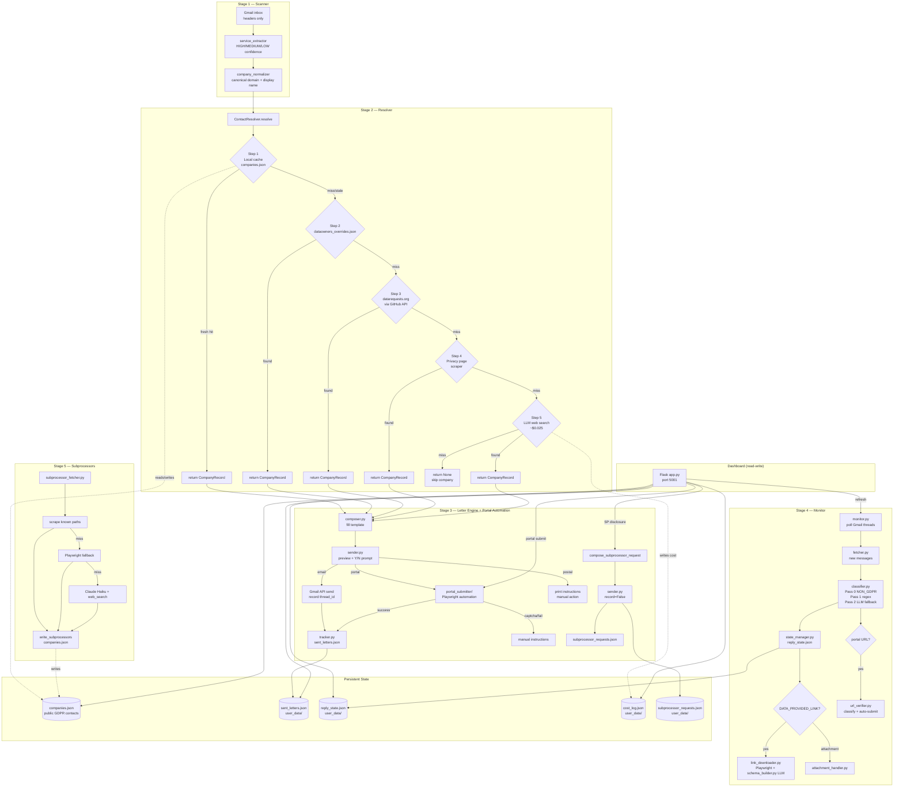

# GDPR Agent — Architecture Document

> **Audience:** Engineers and LLMs who need to understand, review, or modify this codebase.
> This is not a README. It assumes the reader can write Python and is unfamiliar with this specific system.

---

## 1. Problem This Solves

Under GDPR (and UK GDPR), individuals have the right to obtain a copy of all personal data a company holds about them — a Subject Access Request, or SAR. Exercising this right at scale is tedious: a typical Gmail inbox contains hundreds of companies that have received personal data (via account sign-ups, purchases, newsletter subscriptions), each requiring its own formal letter sent to a different privacy email address or web portal, followed by a 30-day wait, a possible identity-verification step, and eventually a data package to download and inspect. The non-trivial parts are: finding the correct GDPR contact for each company (which may require scraping a privacy page, querying an open-source database, or asking an LLM to search the web), normalising company identity across hundreds of overlapping email senders (accounts.google.com, youtube.com, and gmail.com are all Google), sending individual letters via Gmail's API, and then monitoring incoming replies to classify them (acknowledged? denied? requires action?) without reading every email manually.

---

## 2. System Overview

The pipeline runs in five stages triggered by `run.py`, with a separate monitoring CLI (`monitor.py`) and a Flask dashboard (`dashboard/app.py`) that also drives portal automation and subprocessor disclosure requests.

Data flows strictly left to right within each run. The resolver writes back to `companies.json` on every successful resolution so the next run hits the cache. The monitor is a separate invocation that reads `sent_letters.json` and writes `reply_state.json`. The dashboard is purely read-only except for the `/refresh` route, which triggers an inline monitor run.

---

## 3. Stage-by-Stage Logic

### Stage 1 — Scanner

**What it does:** Identifies which companies have received personal data by examining Gmail message headers, deduplicated to a single canonical entry per company.

**How it works:** `inbox_reader.py` fetches up to 500 email headers using the Gmail API's `messages.list` + `messages.get(format="metadata")` combination. It never fetches message bodies — only `From`, `Subject`, and `Date` headers — which keeps the OAuth scope to `gmail.readonly` and avoids handling potentially sensitive content. The returned list is handed to `service_extractor.py`, which runs a series of regex heuristics against the sender address and subject line to classify each email as a HIGH, MEDIUM, or LOW confidence service signal. HIGH confidence means the email is clearly a transactional/welcome message (e.g. subject matches "welcome to", "your order", "invoice"); MEDIUM covers newsletters and notifications; LOW covers everything else. The extractor deduplicates senders by canonical domain (via `company_normalizer.canonical_domain()`), keeping the highest confidence level seen and recording `first_seen`/`last_seen` date ranges.

`company_normalizer.py` handles the non-obvious mapping from raw email domains to canonical registrable domains. It strips known noise subdomains (`noreply.`, `accounts.`, `support.`, `mail.`, `notifications.`, etc.) and handles two-part country-code TLDs (`.co.uk`, `.com.au`) to avoid treating `amazon.co.uk` and `amazon.com` as different companies. It also maintains a hardcoded alias table: `t.co` → Twitter/X, `youtube.com` → google.com, `instagram.com` → facebook.com, `ibkr.com` → interactivebrokers.com, and others. The result is a clean list of `{domain, company_name_raw, confidence, first_seen, last_seen}` dicts.

**Key assumptions:** The Gmail inbox belongs to a single person who has consented to scanning. Email headers alone are sufficient to identify services — body content is never read. The `From` header's domain is a reliable proxy for the company's identity.

**Known limitations:** The confidence classification is entirely heuristic and has no feedback loop — a transactional email from an unusual sender (e.g. a legal firm's automated system) may be misclassified as LOW. The alias table is manually maintained and will miss new alias relationships. Subdomains are stripped by a fixed allowlist, so an unusual subdomain like `eu-mail.example.com` would yield `eu-mail.example.com` as the canonical domain rather than `example.com`.

---

### Stage 2 — Resolver

**What it does:** For each discovered company domain, finds the correct GDPR/privacy contact details (email address, portal URL, or postal address) using a five-step lookup chain that escalates from free to paid.

**How it works:** `resolver.py` implements `ContactResolver.resolve(domain, company_name)` as a chain of five steps, each of which returns immediately on success. This prevents unnecessary API calls.

**Step 1 — Local cache** (`data/companies.json`): A JSON file committed to the repo that stores `CompanyRecord` objects keyed by domain. If a record exists and its `last_verified` date is within the TTL for its source (180 days for datarequests/overrides, 90 days for scraper/LLM results, 365 days for manually entered records), it is returned immediately. On cache miss or stale record, the chain continues. Every successful resolution from any downstream step writes back to this cache.

**Step 2 — Dataowners overrides** (`data/dataowners_overrides.json`): A hand-curated file of high-confidence records for major services (Google, Meta, Apple, Spotify, etc.) where the correct contact is well-known. When a match is found, `last_verified` is set to today before returning, ensuring the cached copy stays fresh within its 180-day TTL. This prevents an infinite stale-loop where a static date in the overrides file would cause the cache to expire and re-read the same static date on every run.

**Step 3 — datarequests.org via GitHub API**: The [datarequests.org](https://www.datarequests.org) project maintains an open-source database of GDPR contacts at `https://github.com/datenanfragen/data/tree/master/companies`. The resolver fetches the directory listing via GitHub's API (unauthenticated, 60 req/hour limit) and caches the listing in memory for the session. It then searches for JSON files whose slugs contain the domain's second-level label or any word from the company name. For each candidate file it downloads and checks whether the target domain appears in the entry's `runs` array — this avoids false matches where a company slug matches by name but not by domain. A successful match is converted from datarequests' format to a `CompanyRecord`.

**Step 4 — Privacy page scraper**: `privacy_page_scraper.py` attempts four well-known URLs in order: `/privacy-policy`, `/privacy`, `/legal/privacy`, `/gdpr`. On the first HTTP 200 response, it strips HTML tags and applies regex patterns to find email addresses whose local part is one of `privacy`, `dpo`, `gdpr`, `legal`, `dataprotection`, `data-protection`, or `dataprivacy` (with a required minimum 2-character TLD and exclusion of internal hostnames like `localhost`, `internal`, `staging`). It separately looks for URLs containing GDPR-specific path segments (`/dsar`, `/data-request`, `/privacy-request`, `/gdpr-request`, `/subject-access`). A record is returned with `source_confidence="medium"` if either an email or portal URL is found.

**Step 5 — LLM web search**: `llm_searcher.py` calls Claude Haiku with the `web_search_20250305` tool (`max_uses=2`) and a system prompt that instructs it to find GDPR contacts and reply with only a JSON object matching the `CompanyRecord` schema. The response is parsed with `json.JSONDecoder().raw_decode()`, starting from the first `{` in the response text — this handles cases where the model emits preamble before the JSON. Only records with at least one populated contact field (`dpo_email`, `privacy_email`, or `gdpr_portal_url`) and a non-low confidence rating are returned. If the LLM call limit set via `--max-llm-calls` is reached, this step is skipped and the resolver returns `None`.

**Key assumptions:** Domains are registrable domains (e.g. `spotify.com`), not full hostnames. The company name passed in is a raw display name that may not match the legal entity name. The GitHub API is available and unauthenticated access is sufficient (60 req/hour).

**Known limitations:** The GitHub API rate limit (60 unauthenticated requests/hour) will be exhausted mid-run at 500+ companies. The resolver warns when `X-RateLimit-Remaining < 10` but does not pause or retry. Adding `GITHUB_TOKEN` to `.env` would raise this to 5,000/hour but is not currently implemented. The scraper cannot handle JavaScript-rendered pages or Cloudflare-protected privacy pages. The 5-step chain is sequential, not concurrent — a 500-company run with many LLM calls will be slow.

---

### Stage 3 — Letter Engine

**What it does:** Composes a formal SAR letter for each resolved company and dispatches it via Gmail, a web portal instruction, or a postal instruction, after showing the user a preview and asking for confirmation.

**How it works:** `composer.py` reads either `templates/sar_email.txt` or `templates/sar_postal.txt` based on `CompanyRecord.contact.preferred_method` and performs simple string substitution of `{company_name}`, `{user_full_name}`, `{user_address_*}`, `{date}`, and `{gdpr_framework}` placeholders. The templates are Article 15 GDPR requests that enumerate the standard set of rights: categories of data, processing purposes, recipients, retention periods, and data origins. The result is a `SARLetter` dataclass.

`sender.py` prints a formatted preview box and prompts the user with `[y/N]`. On approval, it dispatches based on method: for `email`, it constructs a `MIMEText` message with explicit UTF-8 encoding (to avoid corruption of non-ASCII characters in names or addresses) and sends via the Gmail API's `messages.send` endpoint, capturing `message_id` and `thread_id` for later reply monitoring. For `portal` and `postal`, it prints instructions for the user to complete manually. All three paths call `tracker.record_sent()` to append the letter to `user_data/sent_letters.json`.

The `--dry-run` flag skips actual dispatch but still records the user's `y` decision. This is used for testing the pipeline without spending Gmail quota.

**Key assumptions:** The user reviews each letter before sending. There is no batch-send or auto-send mode (the pipeline is explicitly interactive). Portal and postal letters cannot be tracked for replies because no Gmail thread ID is generated.

**Known limitations:** Portal and postal letters enter the monitoring system with an empty `gmail_thread_id`, which means the monitor cannot poll for replies. These companies will stay in `PENDING` status indefinitely unless portal automation succeeds. The Y/N prompt makes fully automated runs impossible — this is intentional but limits large-scale use.

#### Portal Automation (`portal_submitter/`)

Automates SAR submission via GDPR web portals using Playwright with stealth scripts. Seven modules:

- **`submitter.py`** — Entry point: `submit_portal(letter, scan_email)`. Detects platform, analyzes form, fills & submits, handles CAPTCHA/OTP, captures screenshots to `user_data/portal_screenshots/`, extracts confirmation references. Falls back to manual instructions on failure.
- **`models.py`** — `PortalResult` (success, needs_manual, confirmation_ref, screenshot_path, error, portal_status) and `CaptchaChallenge` (domain, portal_url, created_at, status, solution, screenshot_path).
- **`form_analyzer.py`** — LLM-powered (Claude Haiku) form field analysis. Extracts form fields via `page.locator("body").aria_snapshot()` (Playwright text-format API, replaces deprecated `page.accessibility.snapshot()`), parses with `_extract_elements_from_aria_snapshot()` regex, calls LLM to map user data to fields. Results cached in `CompanyRecord.portal_field_mapping` with 90-day TTL (`cached_at` checked before re-analyzing). Cost tracked via `cost_tracker`.
- **`form_filler.py`** — Playwright automation: fills textbox/combobox/checkbox fields, clicks submit. `detect_captcha_type(page)` returns `"interactive"`, `"invisible_v3"`, or `"none"` — invisible reCAPTCHA v3 (`.grecaptcha-badge`) is distinguished from interactive CAPTCHAs. Injects stealth JavaScript to bypass automation detection.
- **`captcha_relay.py`** — Bridges CAPTCHA challenges to the dashboard for manual solving. Saves screenshot + challenge JSON to `user_data/captcha_pending/{domain}.png|.json`. Polls for user solution with 5-minute timeout (2-second intervals). Files cleaned on solution or timeout.
- **`otp_handler.py`** — Handles email verification steps during portal submission. `wait_for_otp()` polls Gmail for verification emails from platform-specific senders. `extract_otp_from_message()` extracts confirmation URLs (preferred) or 6-digit codes. 2-minute timeout.
- **`portal_navigator.py`** — Multi-step portal navigation. `navigate_to_form(page, platform, api_key=)` dismisses cookie banners first, then uses platform-specific hint patterns (free, fast) then LLM-guided fallback (Claude Haiku, max 3 steps via `aria_snapshot()`). Called by `submitter.py` when landing page has no form fields. Hint patterns in `_NAVIGATION_HINTS` dict, extensible per platform. `page_has_form(page)` checks for *visible* input/textarea/select (iterates `.all()` + `.is_visible()` to exclude hidden cookie/tracking inputs). Click helpers include `"tab"` role and force-click fallback for overlay-intercepted elements.
- **`platform_hints.py`** — Detects portal platform: `onetrust`, `trustarc`, `ketch`, `salesforce`, `login_required` (Google, Apple, Meta, Amazon, Facebook, Twitter/X), `unknown`. `detect_platform(url, html="")` checks URL patterns first, then HTML signatures for branded domains (e.g. zendesk.es → ketch via `_KETCH_HTML_SIGNATURES`). `otp_sender_hints()` returns expected verification email senders per platform.

**Portal-specific constraints:**
- Ketch portals (Zendesk) use reCAPTCHA v3 invisible — headless Playwright always fails the score check. `submitter.py` detects this (`"bot-like behavior"` text after submit) and returns `needs_manual=True`. The headless browser session is destroyed after the attempt, so the form cannot be "pre-filled" for the user.
- Login-required portals (Google, Apple, Meta, Amazon, Facebook, Twitter/X) are detected by `platform_hints.py` and fall back to manual instructions.
- `Playwright ≥1.58`: `page.accessibility.snapshot()` is removed. Use `page.locator("body").aria_snapshot()` which returns a text-format accessibility tree (not JSON).

#### Subprocessor Disclosure Request Path

A parallel composition path for subprocessor disclosure letters: `compose_subprocessor_request(record, *, to_email_override="") → SARLetter | None` uses `templates/subprocessor_request_email.txt` / `subprocessor_request_postal.txt` (cites CJEU C-154/21 and EDPB Opinion 22/2024, requests AI providers, data brokers, advertising platforms by name). Logged to `user_data/subprocessor_requests.json` via `record_subprocessor_request(letter, domain)`.

`to_email_override` is a fallback email (typically the SAR `to_email`) used when the record has no privacy/dpo email — the dashboard passes `sar_state.to_email` so disclosure requests can be sent even when only a generic contact address is known. Returns `None` if no usable email contact exists and method is not postal.

**Critical invariant:** `send_letter(record=False)` must be used for all SP disclosure request sends. SP letters are tracked in `subprocessor_requests.json`, never `sent_letters.json`. If SP letters leak into `sent_letters.json`, `promote_latest_attempt()` will corrupt SAR state (wrong thread_id, lost replies).

---

### Stage 4 — Monitor

**What it does:** Polls Gmail for replies to sent SARs, classifies each reply into one or more structured tags, downloads any attached or linked data packages, and maintains a per-domain status derived from the accumulated reply history.

**How it works:** `monitor.py` is the CLI entry point. It loads `sent_letters.json` to get the list of sent SARs (including their Gmail thread IDs), then for each SAR calls `fetcher.fetch_replies_for_sar()`.

`fetcher.py` uses the Gmail thread ID when available — it fetches all messages in the thread and filters out the user's own outgoing message by comparing the `From` header to the authenticated user's email. When no thread ID is available (portal/postal letters), it falls back to two Gmail search queries: one for exact sender address match and one for domain match. Messages are deduplicated against already-seen message IDs. Skips only the first message (the original sent letter); subsequent outgoing messages (user's manual Gmail replies) are returned with `from_self=True`. `monitor.py` converts `from_self` messages into `ReplyRecord` with `tags=["YOUR_REPLY"]` without LLM classification. `YOUR_REPLY` is excluded from status computation in `state_manager.py` and from company reply counts on dashboard cards — it is display-only.

Each new message is passed to `classifier.classify()`, which applies a three-pass strategy:

- **Pass 0 (NON_GDPR pre-pass):** Scores the message on five independent signals: strong marketing local parts (`news`, `digest`, `jobs`, `marketing`, `career`, `noreply-jobs`, `community`, `newsletters`) score +2; `alerts@` scores +1 (reduced from +2 after review, since GDPR-compliant services legitimately send breach alerts from `alerts@`); display names containing marketing keywords score +1; subjects matching newsletter/job-alert patterns score +1; snippets containing unsubscribe language score +1; zero-width Unicode characters (newsletter email-client spacers) score +1. A threshold of 2 or more signals triggers early return of `["NON_GDPR"]` — these messages are invisible to all status computations.

- **Pass 1 (regex):** 18 compiled patterns match against the `from`, `subject`, and `snippet` fields to produce tags. Multiple tags can fire on a single message. If `BOUNCE_PERMANENT` and `BOUNCE_TEMPORARY` both fire, only `BOUNCE_TEMPORARY` is kept (the 4xx transient signal overrides the 5xx permanent one). If the message has an attachment and no `DATA_PROVIDED_LINK` tag fired, `DATA_PROVIDED_ATTACHMENT` is added.

- **Body-level pass:** After Pass 1, the full decoded message body is scanned for additional patterns that are commonly absent from snippets. `_RE_BODY_WRONG_CHANNEL` detects **self-service deflection** responses — where the company tells the user to manage their own data via an account portal rather than delivering it directly. `_RE_BODY_WRONG_CHANNEL` is intentionally conservative (requires specific deflection phrases such as "available to you through our tools" or "sign in to your account to manage your data") to avoid false positives on bodies that merely contain account links. `_RE_BODY_INLINE_DATA` detects structured personal data provided directly in the email body, replacing false `DATA_PROVIDED_ATTACHMENT` tags that fire on CID inline images. `_RE_ZENDESK_ATTACHMENT_A/B` patterns detect Zendesk-format linked attachments (`filename.zip\nURL` and `Attachment(s): filename.zip - URL`). Closure detection patterns (Zendesk "set to Solved", premature ticket closure) are included with a post-pass guard that suppresses WRONG_CHANNEL when a terminal data tag is already present.

- **URL extraction:** `_extract()` searches the full body for download links using a four-pass strategy: (A) Zendesk/support-platform expanded format — `filename.zip\nURL` on separate lines, which correctly handles multi-file deliveries without URL concatenation; (B) generic download URL patterns (token URLs, path-based `/download/` or `/export/` segments, token query params); (C) Zendesk compact inline format — `Attachment(s): filename.zip - URL`; (D) any URL within 400 chars of data/export/download keywords. All matching URLs are collected into `data_links` (list) in addition to `data_link` (first URL, kept for backward compatibility). Unicode smart quotes and HTML artefacts are stripped from all extracted URLs.

- **Link-first promotion:** Handles **notification-shell emails** — where the body is a brief "your export is ready" message containing a download URL, but the subject and snippet contain no recognisable data-delivery keywords. After extraction, if `data_link` is populated, `_is_data_url()` validates that the URL points to a data file (requires a downloadable extension, a `/download/`-style path, or a token query param) before tagging `DATA_PROVIDED_LINK`. This guard prevents generic account or privacy-policy URLs from triggering false positives.

- **Junk URL filter:** `_RE_JUNK_URL` + `_is_junk_url()` filters Zendesk ticket URLs, survey URLs, help center paths (`/requests/`, `/support/tickets/`, `/help/`), and vendor/sub-processor pages from all extraction passes. Prevents false positives on `data_link` and `portal_url`.

- **`extracted` field schema** (all keys always present, empty/null if not found): `reference_number` (ticket/case ref), `confirmation_url` (URL to confirm request), `data_link` (first export URL, backward compat), `data_links` (all export URLs), `portal_url` (self-service portal), `deadline_extension_days` (integer or null), `summary` (plain-English ≤15-word sentence — LLM path only, empty string on regex path).

- **`extracted` field reliability:** `data_link` and `portal_url` can contain false positives — e.g. a privacy policy URL misclassified as a data export link, or multiple URLs concatenated. Templates gate link display on reply tags (see Dashboard UI Components section). Do not trust `extracted` URLs without checking the reply's tags.

- **Pass 2 (LLM fallback):** Only triggers if the regex produced no tags, or produced only `AUTO_ACKNOWLEDGE`. The LLM prompt now includes the first 500 chars of the body (not just the snippet) and explicit guidance to tag `DATA_PROVIDED_LINK` when a download URL is present. Results are cached in a module-level `_llm_cache` dict keyed by `(from_addr, subject)` to prevent re-classifying identical auto-replies from the same company. The cache is in-memory only and resets between runs.

After classification, `attachment_handler.py` downloads any Gmail attachment parts and catalogs their contents. For ZIP files it recursively lists files and guesses data categories from filenames. For JSON and CSV files it extracts top-level keys and column headers respectively.

`state_manager.py` loads and saves `user_data/reply_state.json`, which is partitioned by account email. It maintains a `CompanyState` for each domain with all accumulated `ReplyRecord` objects. The derived `status` (computed on demand, never stored) follows this priority order: `BOUNCED > OVERDUE > ACTION_REQUIRED > DENIED > COMPLETED > EXTENDED > USER_REPLIED > PORTAL_VERIFICATION > PORTAL_SUBMITTED > ADDRESS_NOT_FOUND > ACKNOWLEDGED > PENDING`. `OVERDUE` fires when today's date exceeds the 30-day GDPR deadline and no terminal tag (data provided, denied, deletion fulfilled) has been seen.

**Status resolution rules:** (1) `_TERMINAL_TAGS` (includes `DATA_PROVIDED_INLINE`) are checked BEFORE action tags — if the company already provided data or fulfilled deletion, stale action items are moot; (2) `USER_REPLIED` fires when all action-tagged replies have `reply_review_status` in `("sent", "dismissed")` OR when a `YOUR_REPLY` exists that postdates the latest action-required reply; (3) `ADDRESS_NOT_FOUND` fires when `address_exhausted=True` on the CompanyState; (4) `PORTAL_VERIFICATION` fires when `portal_status == "awaiting_verification"` (no reply yet but portal needs confirmation); (5) `PORTAL_SUBMITTED` fires when `portal_status in ("submitted", "awaiting_captcha")`.

**Portal helpers:** `set_portal_status(state, portal_status, *, confirmation_ref, screenshot)` updates `CompanyState.portal_status` and logs the transition. `verify_portal(state)` marks portal verification as passed, resets `portal_status` to `"submitted"`, and restarts the 30-day deadline from the verification date. `log_status_transition(state, old, new, reason)` appends to `state.status_log`. `save_portal_submission()` persists portal submission state to reply_state.json — **never** to sent_letters.json.

**`promote_latest_attempt()`:** When multiple SAR letters were sent to the same domain (e.g. first address bounced, user retried with a new address), this function ensures the most recent letter is the "active" attempt. Older attempts — along with their replies — are archived into `CompanyState.past_attempts`. Called by `_load_all_states()` on every dashboard load. Portal field preservation: carries forward `portal_status`, `portal_confirmation_ref`, `portal_screenshot`, `portal_verified_at`, `status_log` from the existing `CompanyState` when available — these may have been updated via `verify_portal()` or `set_portal_status()` since the sent record was created. Falls back to the sent record's portal fields only when no existing state exists. `compute_status()` also checks `past_attempts` for terminal tags (DATA_PROVIDED, FULFILLED_DELETION) so a company that received data on a previous attempt retains COMPLETED status.

For replies tagged `DATA_PROVIDED_LINK`, the monitor iterates the full `data_links` list and attempts to download each linked data package using `link_downloader.py`. Playwright (headless Chromium) is tried first because many data download pages are Cloudflare-protected; if Playwright is not installed, `requests` is used as a fallback. After download, `schema_builder.py` sends file samples to Claude Haiku for LLM-powered schema analysis, producing a structured description of what categories of personal data the export contains. `schema_builder` has two entry points: `build_schema(file_path)` for downloaded files (ZIP/JSON/CSV) and `build_schema_from_body(body)` for inline email data (`DATA_PROVIDED_INLINE` replies). Both return `{categories, services, export_meta}` dicts stored as `attachment_catalog` on the reply.

`url_verifier.py` classifies URLs extracted from replies as `gdpr_portal`, `help_center`, `login_required`, `dead_link`, `survey`, or `unknown`. Layered strategy: (1) fast path via `platform_hints.detect_platform()` for login-required and known platforms; (2) URL path heuristics for surveys and help centers; (3) HTTP fetch + HTML inspection for form/submit detection. `verify_if_needed()` uses 7-day TTL caching. Results stored on `ReplyRecord.portal_verification`. When `monitor.py` classifies a WRONG_CHANNEL/CONFIRMATION_REQUIRED/DATA_PROVIDED_PORTAL reply with a portal URL, it runs verification and auto-submits via `portal_submitter` if the URL is a real GDPR portal.

**Key assumptions:** The Gmail thread ID accurately identifies the reply thread. Replies arrive in the same thread as the original SAR email (true for most companies, not true for all). The 30-day deadline is computed from `sar_sent_at` — a company that processes the request in 29 days and 23 hours will not appear as `OVERDUE`.

**Known limitations:** Portal and postal SARs cannot be monitored because there is no thread ID. The `_llm_cache` for the classifier is in-memory only — identical auto-replies processed in separate `monitor.py` runs will each trigger an LLM call. If `sar_sent_at` is `None` or empty (which can happen for portal/postal letters), `days_remaining()` returns 30 and `deadline_from_sent()` returns today + 30 days — a safe default but not meaningful.

---

### Stage 5 — Subprocessors

**What it does:** Discovers third-party data processors (subprocessors) for each SAR company by scraping public subprocessor pages and falling back to LLM web search.

**How it works:** `contact_resolver/subprocessor_fetcher.py` implements `fetch_subprocessors(company_name, domain)` returning a `SubprocessorRecord`.

Strategy: (1) Scrape known paths (`/sub-processors`, `/vendors`, etc.) with `requests` for both bare and `www.` domain. (2) `_extract_page_content()` extracts `<table>` elements first (subprocessor pages nearly always use tables), then falls back to a keyword-anchored text window, then full stripped text — a page must yield ≥500 chars of plain text (`_MIN_PLAIN_TEXT`) to be considered non-empty. (3) Playwright fallback for JS-rendered SPAs. (4) Claude Haiku call — `web_search` tool only attached when no scraped content was found (saves output tokens for JSON).

The background task (`_fetch_all_subprocessors`) in `dashboard/app.py` only skips a domain if it has `fetch_status="ok"` within the 30-day TTL — `not_found` and `error` records are always retried.

`write_subprocessors(domain, record)` persists a `SubprocessorRecord` into `data/companies.json`. If the domain has no existing entry it creates a minimal stub (`source="llm_search"`, `source_confidence="low"`) so subprocessors are stored for all SAR domains regardless of whether contact resolution succeeded. Never skip-on-missing — without stubs, subprocessors silently don't persist for domains only in reply_state.json.

**Known limitations:** Subprocessor pages are frequently behind logins or behind JavaScript frameworks that Playwright cannot always render. The 30-day TTL means stale subprocessor data can persist. The `web_search` tool adds cost when scraping fails.

---

### Dashboard

**What it does:** Provides a web UI at `localhost:5001` for reviewing SAR status, viewing reply threads, inspecting data schemas, managing portal submissions, sending subprocessor disclosure requests, and seeing LLM cost history.

**How it works:** `dashboard/app.py` is a Flask application. It reads `reply_state.json`, `sent_letters.json`, `companies.json`, and `cost_log.json` on every request — there is no in-memory state. This makes it safe to run while `monitor.py` is also running, at the cost of disk reads on every page load.

**Important:** Always use `_load_all_states(account)` — not `load_state()` — for any route that displays company counts or cards. `_load_all_states()` merges reply_state.json with sent_letters.json via `promote_latest_attempt()` so recently-sent letters appear immediately without waiting for a monitor run. Using `load_state()` directly undercounts by missing companies sent since the last monitor run.

**`_lookup_company(domain)`** merges `data/companies.json` (handles nested `{"companies": {...}}` structure) with `data/dataowners_overrides.json`. Override contact fields are deep-merged (non-empty values win). Used by `company_detail()` to provide `portal_url` template var and by `portal_submit`/`mark_portal_submitted` routes.

#### Route Reference

**Core routes:**
- `GET /` — all companies dashboard
- `GET /company/<domain>` — reply thread detail
- `GET /data/<domain>` — data catalog viewer
- `GET /cards` — companies with/without data (Data Cards view)
- `GET /costs` — LLM cost history
- `GET /transfers` — subprocessor data transfer map + D3.js graph
- `GET /pipeline` — scan/resolve/send pipeline
- `GET /pipeline/review` — letter review & approve
- `GET /pipeline/reauth-send` — re-authorize gmail.send OAuth
- `POST /refresh` — runs monitor + re-extracts missing links, saves to reply_state.json

**Portal automation routes:**
- `POST /portal/submit/<domain>?account=EMAIL&portal_url=URL` — starts background portal submission. Accepts `portal_url` query param for WRONG_CHANNEL companies whose `preferred_method` is not "portal"; falls back to resolver then `dataowners_overrides.json`. Returns 409 if already running. Syncs portal status to `CompanyState` via `set_portal_status()`.
- `GET /portal/status/<domain>` — polls task progress. Returns **flat JSON** with `status`, `success`, `needs_manual`, `portal_status`, `confirmation_ref`, `error` — NOT nested under a `result` key. JS must read `sd.success` not `sd.result.success`.
- `POST /portal/verify/<domain>` — marks portal verification as passed. Restarts 30-day deadline via `verify_portal()`. Returns JSON with updated `portal_status`, `deadline`, `portal_verified_at`.
- `POST /company/<domain>/mark-portal-submitted` — manual marking after user fills portal form themselves. Persists `portal_submission.status="submitted"` to reply_state.json.
- `GET /captcha/<domain>` — displays CAPTCHA screenshot + solution form
- `POST /captcha/<domain>` — accepts user CAPTCHA solution, resumes portal submission

**Background task routes:**
- `POST /transfers/fetch` — starts subprocessor fetch task
- `GET /api/transfers/task` — polls task progress
- `POST /transfers/request-letter/<domain>` — sends SP disclosure request for one company (falls back to SAR `to_email` when no privacy/dpo email)
- `POST /transfers/request-all` — background task, sends to all companies with email contact and no prior request, tracked in `subprocessor_requests.json`; also uses SAR email fallback

**Compose routes:**
- `POST /company/<domain>/compose-reply` — sends SAR follow-up email, creates YOUR_REPLY record, auto-dismisses pending action drafts
- `POST /company/<domain>/compose-sp-reply` — sends SP follow-up email

#### UI Components

**Navbar** (`base.html`): Centered tab navigation (Dashboard, Pipeline, Data Cards, Costs, Transfers) with `active_tab` highlighting. Account selector and action buttons in ``. Logout is a small `btn-outline-secondary` button in the right-side control group.

**Transfer Graph** (`/transfers`): D3.js v7 force-directed visualization of subprocessor data flows. `dashboard/services/graph_data.py` builds graph JSON (nodes + edges + stats) from subprocessor rows and company records, with configurable depth (1–6 layers, default 4 via `?depth=N` query param). `dashboard/services/jurisdiction.py` provides GDPR adequacy assessment — classifies countries as EU/EEA, adequate (DPF, bilateral), or third-country for risk coloring. `dashboard/static/js/transfer-graph.js` renders the graph with zoom controls, coverage donut, and depth selector.

**Data Cards** (`cards.html`): Account selector dropdown in `nav_extra`. Cards show a `Wrong channel` warning badge (yellow border + badge) when `is_wrong_channel` is true. Two sections: "With data" and "Without data" with tab navigation.

**Company detail** (`company_detail.html`): Two-panel layout with a `stream_panel()` Jinja2 macro rendering SAR and SP streams independently. `company_detail()` builds `sar_thread` and `sp_thread` as separate event lists (oldest first). `sp_all_msg_ids` (all SP reply IDs including `YOUR_REPLY`) is used to dedup SAR replies — if a message appears in the SP stream, it is excluded from SAR. Thread events have types: `sent` (outgoing letter), `reply` (company message), `your_reply` (user's manual Gmail reply or dashboard-sent follow-up). NON_GDPR replies are hidden entirely from the detail view (not dimmed). Links in reply messages are gated on tags: "Download data" requires `DATA_PROVIDED_*` or `FULFILLED_DELETION`; "Privacy portal" requires `WRONG_CHANNEL`, `DATA_PROVIDED_PORTAL`, `CONFIRMATION_REQUIRED`, or `MORE_INFO_REQUIRED`; "Confirm request" requires `CONFIRMATION_REQUIRED`. Portal URL in template uses `display_portal_url = ex.portal_url or portal_url` where `portal_url` comes from `_lookup_company(domain)`. WRONG_CHANNEL replies with a portal URL show a "Submit SAR via portal" button — `submitViaPortal()` JS shows live step-by-step progress ("Opening portal…", "Filling in your details…") and displays actionable results (success, reCAPTCHA blocked with manual instructions, or failure). A "View received data" button links to `/data/<domain>` on messages with data provision tags or attachments. Each stream panel includes a "Compose follow-up" collapsible form at the bottom of the thread for free-form replies. When `state.portal_submission` exists, a status bar appears above the thread: green for "submitted", blue for "manual needed" (with "Mark as submitted" form), yellow for "failed".

**Dashboard cards:** Show a "View correspondence" button (no reply count) — styled `btn-outline-primary` when the company has at least one non-`NON_GDPR`, non-`YOUR_REPLY` reply, pale `btn-outline-secondary` otherwise. A "View data" button appears when `has_data` is true (status=COMPLETED with a DATA_PROVIDED tag).

**Snippet display:** Raw Gmail snippets often contain encoding artifacts (HTML entities, MIME quoted-printable, URL encoding). `_clean_snippet(text)` in `dashboard/app.py` decodes these at display time — raw data in `reply_state.json` is never modified. Applied in `company_detail()` for SAR replies, past-attempt replies, and SP replies. `_is_human_friendly(text)` is the paired test predicate; it is not called in production routes.

**Draft reply guard:** `has_pending_draft` (used to show the "Draft reply ready" badge on cards) requires three conditions: `reply_review_status == "pending"`, a non-empty `suggested_reply`, **and** at least one tag in `_ACTION_DRAFT_TAGS` (imported from `reply_monitor.classifier`). The tag guard prevents stale `"pending"` state on AUTO_ACKNOWLEDGE or other non-action replies from showing a false-positive badge. `company_detail.html` applies the same guard (`r.has_action_draft`) before rendering the draft form. When a YOUR_REPLY is detected by the monitor, all pending action drafts for that company are auto-dismissed. Both `monitor.py` and the dashboard's inline monitors apply this auto-dismiss logic.

**LLM summary:** When `classifier.py` falls back to Claude Haiku, it also populates `extracted["summary"]` — a ≤15-word plain-English sentence. `company_detail.html` shows this in italic instead of the raw snippet when present. Summary is only set on the LLM path (~10–20% of replies).

**Tag display:** `_effective_tags(all_tags)` in app.py applies tier-based supersession for cards:

| Tier | Type | Tags |
|------|------|------|
| 1 | Terminal | DATA_PROVIDED_*, REQUEST_DENIED, NO_DATA_HELD, NOT_GDPR_APPLICABLE, FULFILLED_DELETION |
| 2 | Action | WRONG_CHANNEL, IDENTITY_REQUIRED, CONFIRMATION_REQUIRED, MORE_INFO_REQUIRED, HUMAN_REVIEW |
| 3 | Progress | REQUEST_ACCEPTED, IN_PROGRESS, EXTENDED |
| 4 | Informational | AUTO_ACKNOWLEDGE, BOUNCE_* |
| — | Always hidden | OUT_OF_OFFICE, NON_GDPR (unless only tag) |

Higher tiers supersede lower — e.g. DATA_PROVIDED hides REQUEST_ACCEPTED; WRONG_CHANNEL hides ACK. `_DISPLAY_NAMES` maps raw constants to user-friendly labels. `HUMAN_REVIEW` is in `_ACTION_TAGS` (state_manager.py) so it triggers ACTION_REQUIRED status.

**Company-Level Status:** `compute_company_status(sar_status, sp_status, sp_sent)` in `state_manager.py` aggregates SAR and SP streams into one company-level badge shown as the primary badge on dashboard cards. 9 values, priority order (highest first):

| Priority | Value | Condition |
|----------|-------|-----------|
| 8 | `OVERDUE` | Any stream past GDPR deadline |
| 7 | `ACTION_REQUIRED` | Any stream needs user action |
| 6 | `STALLED` | Any stream is BOUNCED or ADDRESS_NOT_FOUND |
| 5 | `USER_REPLIED` | SAR=USER_REPLIED — user sent follow-up, awaiting company response |
| 4 | `DATA_RECEIVED` | SAR terminal (COMPLETED/DENIED); SP sent but not yet terminal |
| 3 | `FULLY_RESOLVED` | SAR terminal + (SP terminal OR SP not sent) |
| 2 | `IN_PROGRESS` | SAR is ACKNOWLEDGED, EXTENDED, PORTAL_SUBMITTED, or PORTAL_VERIFICATION |
| 1 | `SP_PENDING` | SAR=PENDING + SP sent + SP=PENDING |
| 0 | `PENDING` | Default — SAR pending, SP not sent |

Invariant: SP can only escalate; `sp_sent=False` never downgrades. `DATA_RECEIVED` ranks above `FULLY_RESOLVED` in sort urgency because the SP thread is still open. `_COMPANY_STATUS_PRIORITY` dict drives sort order. `COMPANY_LEVEL_STATUSES` list in `models.py` is the canonical list of 9 values.

**Known limitations:** The `/refresh` route blocks the HTTP response during the full monitor run — flagged for future async handling. Port 5001 is hardcoded. There is no authentication (local-only tool).

---

## 4. Data Model

### `data/companies.json` (committed to repo)

The public GDPR contact cache. Safe to commit because it contains only publicly stated contact information — no PII. Keyed by registrable domain (e.g. `"spotify.com"`), each value is a serialised `CompanyRecord`.

**Key fields:**
- `company_name` — display name (e.g. "Spotify")
- `legal_entity_name` — GDPR controller legal name (e.g. "Spotify AB")
- `source` — which resolver step populated this: `"datarequests"`, `"llm_search"`, `"user_manual"`, `"dataowners_override"`, or `"privacy_scrape"`
- `source_confidence` — `"high"`, `"medium"`, or `"low"` (low records are never returned)
- `last_verified` — ISO date string; staleness is computed against this
- `contact.dpo_email` / `contact.privacy_email` — GDPR contact emails (prefer DPO if both present)
- `contact.gdpr_portal_url` — web portal URL if the company prefers portal over email
- `contact.preferred_method` — `"email"`, `"portal"`, or `"postal"`
- `flags.portal_only` — if true, email is not accepted; letter engine skips email dispatch
- `request_notes.special_instructions` — free text shown to user before composing letter
- `request_notes.identity_verification_required` — flag; shown in dashboard action hints
- `portal_field_mapping` — optional cached `PortalFieldMapping` with `cached_at`, `platform`, `fields: list[PortalFormField]`, `submit_button` — 90-day TTL. Used by `form_analyzer.py` to avoid re-analyzing portal forms.

**What breaks if malformed:** `CompanyRecord.model_validate_json()` is called on load; any schema violation causes the entire DB to be treated as empty (`CompaniesDB()` is returned) and all cached contacts are lost, forcing a fresh resolution run. This is silent — no error is printed.

---

### `data/dataowners_overrides.json` (committed to repo)

Hand-curated high-confidence records for major services. Same schema as individual `companies.json` entries. The resolver reads this in Step 2 and always sets `last_verified = date.today()` on the returned record before saving it to the cache — this prevents an infinite stale loop that would occur if a static date in this file were older than the 180-day TTL.

**What breaks if malformed:** `json.loads()` failure is caught; the file is treated as empty and Step 2 is skipped silently.

---

### `user_data/sent_letters.json` (gitignored)

Append-only log of sent SAR letters. Created by `tracker.record_sent()`. Read by both `monitor.py` and the dashboard to enumerate which companies have been contacted and what thread IDs to poll.

**Key fields per entry:**
- `sent_at` — ISO datetime (e.g. `"2026-02-01T14:23:00"`)
- `company_name` — display name used to label the state entry
- `method` — `"email"`, `"portal"`, or `"postal"`
- `to_email` — recipient address; used by fetcher as a search query fallback
- `subject` — subject line used; stored for reference
- `gmail_message_id` / `gmail_thread_id` — IDs returned by Gmail API after send; `gmail_thread_id` is the primary key for reply monitoring. Both are empty strings for portal/postal letters.

**What breaks if malformed:** `json.loads()` failure is caught by `get_log()`, which returns `[]`. This means a corrupt file causes all monitoring and dashboard state to appear empty — the user's SAR history effectively vanishes until the file is repaired manually.

---

### `user_data/reply_state.json` (gitignored)

Per-account, per-domain reply state. Written by `state_manager.save_state()` after every monitor run.

**Top-level structure:** `{ "<safe_email_key>": { "<domain>": <CompanyState> } }` where the safe email key replaces `@` with `_at_` and `.` with `_` (e.g. `"jane_at_example_com"`).

**Key fields in `CompanyState`:**
- `domain` / `company_name` — identity
- `sar_sent_at` — ISO datetime of the sent letter (copied from `sent_letters.json`)
- `to_email` / `subject` / `gmail_thread_id` — mirrored from sent record
- `deadline` — ISO date, 30 days from `sar_sent_at`; computed at state creation
- `replies` — list of `ReplyRecord` objects in receipt order
- `last_checked` — ISO datetime of the last monitor poll
- `past_attempts` — archived older attempts, each with `to_email`, `gmail_thread_id`, `sar_sent_at`, `deadline`, `replies`. Populated by `promote_latest_attempt()` when a retry is detected.
- `address_exhausted: bool` — all known addresses bounced; triggers `ADDRESS_NOT_FOUND` status
- `portal_submission: dict | None` — portal submission tracking: `{status, submitted_at, portal_url, confirmation_ref, error}`. Status: `"submitted"` (auto or manual), `"manual"` (needs manual — e.g. reCAPTCHA blocked), `"failed"`. Persisted by `save_portal_submission()`.
- `portal_status: str` — `""` | `"submitted"` | `"awaiting_verification"` | `"awaiting_captcha"` | `"manual"` | `"failed"`. Drives `PORTAL_SUBMITTED`/`PORTAL_VERIFICATION` SAR statuses. Updated by `set_portal_status()` and `verify_portal()`.
- `portal_verified_at: str` — ISO datetime when portal verification was confirmed. Set by `verify_portal()`, which also resets `deadline` to 30 days from this date.
- `portal_confirmation_ref: str` — reference/ticket number returned by the portal.
- `portal_screenshot: str` — path to confirmation screenshot.
- `status_log: list[dict]` — status transition audit log, each entry `{from, to, at, reason}`. Appended by `log_status_transition()`.

**Key fields in `ReplyRecord`:**
- `gmail_message_id` — dedup key; ensures the same message is never processed twice
- `received_at` — ISO datetime
- `from_addr`, `subject`, `snippet` — raw Gmail fields
- `tags` — list of classification tags
- `extracted` — dict with `reference_number`, `confirmation_url`, `data_link` (first URL, for backward compat), `data_links` (all URLs — multi-file deliveries like Substack send multiple ZIPs), `portal_url`, `deadline_extension_days`
- `llm_used` — boolean; shown as an indicator in the dashboard
- `has_attachment` / `attachment_catalog` — attachment metadata if downloaded
- `suggested_reply: str` — LLM-generated draft follow-up text (empty if not generated)
- `reply_review_status: str` — `""` (unseen) | `"pending"` (draft ready) | `"sent"` (user replied) | `"dismissed"`
- `sent_reply_body: str` — actual text the user sent (may differ from `suggested_reply` if edited before sending)
- `sent_reply_at: str` — ISO 8601 UTC timestamp of when the user sent the follow-up
- `portal_verification: dict | None` — URL verification result: `{url, classification, checked_at, error, page_title}`. Classification values: `gdpr_portal`, `help_center`, `login_required`, `dead_link`, `survey`, `unknown`. Set by `monitor.py` when a reply has a portal URL and tags include WRONG_CHANNEL, CONFIRMATION_REQUIRED, or DATA_PROVIDED_PORTAL.

**What breaks if malformed:** `json.JSONDecodeError` is caught in both `load_state()` and `save_state()` — a corrupt file causes the account's state to reset to empty, losing all reply history for that account. The monitor will re-fetch and re-classify all messages on the next run (duplicate detection by `gmail_message_id` prevents duplicate entries, but the LLM fallback may be called again for previously-classified messages).

---

### `user_data/cost_log.json` (gitignored)

Persistent log of every LLM API call made. Appended to by `cost_tracker._persist()` on every LLM call during production runs (skipped during pytest via `PYTEST_CURRENT_TEST` env check). Rotates at 1,000 entries — oldest entries are dropped.

**Key fields per entry:**
- `timestamp` — ISO datetime
- `source` — `"contact_resolver"` or `"reply_classifier"` or `"schema_builder"`
- `company_name` — which company triggered the call
- `model` — model ID (always `"claude-haiku-4-5-20251001"` currently)
- `input_tokens` / `output_tokens` / `cost_usd` — for accounting
- `found` — boolean; whether the LLM actually returned usable data

**What breaks if malformed:** `load_persistent_log()` catches all exceptions and returns `[]`. The cost dashboard and cumulative totals will show zero history but the pipeline continues normally.

---

### `user_data/subprocessor_requests.json` (gitignored)

Log of sent subprocessor disclosure request letters. Created by `record_subprocessor_request(letter, domain)`. Same structure as `sent_letters.json` entries but tracked separately. **Must never be mixed with `sent_letters.json`** — see SP letter invariant in Stage 3.

---

### Portal Automation Models (`portal_submitter/models.py`)

Not persisted as standalone files — these are runtime types:

- **`PortalResult`** — returned by `submit_portal()`: `success: bool`, `needs_manual: bool`, `confirmation_ref: str`, `screenshot_path: str`, `error: str`, `portal_status: str`.
- **`CaptchaChallenge`** — bridges portal submission to dashboard CAPTCHA UI: `domain`, `portal_url`, `created_at`, `status`, `solution`, `screenshot_path`. Files stored in `user_data/captcha_pending/{domain}.png|.json`.

---

## 5. External Dependencies

### Gmail API (Google Cloud)

**Used for:** Fetching email headers in Stage 1 (`gmail.readonly` scope); sending SAR letters in Stage 3 (`gmail.send` scope); fetching reply messages and thread contents in Stage 4 (readonly). The two scopes require separate OAuth tokens stored as `{email}_readonly.json` and `{email}_send.json`.

**Setup:** Requires a Google Cloud project with the Gmail API enabled and a `credentials.json` OAuth client credentials file at the repo root. First-run triggers a browser-based OAuth consent flow. Tokens are stored in `user_data/tokens/` and refreshed automatically by the Google auth library.

**If unavailable:** Stage 1 fails immediately and the run exits. Stage 3 email dispatch falls back to printing the letter body with a "send manually" instruction — portal/postal methods are unaffected. Stage 4 monitoring skips the account silently (the fetcher returns an empty list).

**Failure mode:** Loud in Stage 1 (exception propagates to `main()`). Quiet in Stages 3 and 4 (caught internally, manual fallback or skip).

---

### Anthropic API (Claude)

**Used for:** Contact resolution (Step 5, `llm_searcher.py`); reply classification fallback (`classifier.py`); data export schema analysis (`schema_builder.py`); portal form analysis (`form_analyzer.py`); portal navigation (`portal_navigator.py`); subprocessor discovery (`subprocessor_fetcher.py`). All calls use `claude-haiku-4-5-20251001`.

**If unavailable:** `llm_searcher.search_company()` returns `None` — the company is skipped. `_llm_classify()` returns `None` — the message gets `["HUMAN_REVIEW"]`. `schema_builder.build_schema()` returns `{}` — no schema is attached to the catalog. In all cases, failure is caught and the pipeline continues.

**Failure mode:** Silent — all three call sites catch `Exception` broadly. Cost tracking still fires for the call even if it fails (the `record_llm_call()` is called after the API call, using actual token counts from `response.usage`).

**Rate limits:** Haiku has generous rate limits at the token scale used here. No rate-limit handling is implemented because it has not been needed in practice.

---

### GitHub API (api.github.com)

**Used for:** Fetching the directory listing of the datarequests.org companies repository, and then downloading individual company JSON files. Unauthenticated, limited to 60 requests/hour.

**If unavailable or rate-limited:** `_fetch_dir_listing()` raises an exception caught by `_search_datarequests()`, which returns `None` — Step 3 is skipped and the chain proceeds to Step 4. The resolver logs a warning when `X-RateLimit-Remaining < 10`.

**Failure mode:** Silent at the company level (Step 3 is skipped). Loud at the session level if the rate limit warning is printed.

**Mitigation:** The directory listing is cached in-memory for the session (`self._dir_listing`), so only one GitHub API call is needed for the listing regardless of how many companies are looked up. Individual company file fetches still count against the limit.

---

### Playwright (optional for downloads, required for portal automation)

**Used for:** (1) Downloading GDPR data packages from links that are Cloudflare-protected or require JavaScript rendering (`link_downloader._download_playwright()`). (2) Portal automation — form analysis, filling, submission, CAPTCHA detection, and navigation (`portal_submitter/`). (3) Subprocessor page scraping as fallback for JS-rendered SPAs (`subprocessor_fetcher.py`).

**If not installed:** For downloads: `import playwright` raises `ImportError`, caught by `_download_playwright()` which returns `None`. The downloader falls back to `requests`. For portal automation: portal submission fails and returns `needs_manual=True`. If Playwright is installed but browser binaries are missing, the error message now includes a hint to run `python -m playwright install chromium`.

**Failure mode:** Silent fallback to `requests` for downloads. For portal automation, failure returns `PortalResult(success=False, needs_manual=True)` and the user receives manual instructions. Portal automation uses stealth scripts (`form_filler.py` injects JavaScript) to bypass automation detection.

---

### requests (HTTP library)

**Used for:** GitHub API calls in the resolver; privacy page scraping; data package download fallback. Always available (listed as a dependency).

**If unavailable:** Would be an import error — catastrophic, cannot run at all.

---

## 6. LLM Usage Map

The system calls an LLM in six places. All use `claude-haiku-4-5-20251001` — never Sonnet or Opus — because the tasks are structured extraction and classification, not open reasoning.

---

### Call site 1: `contact_resolver/llm_searcher.py` — `_extract_with_websearch()`

**Why LLM is used here:** Steps 1–4 (cache, overrides, datarequests.org, privacy page scraper) fail for companies with non-standard privacy page URLs, JavaScript-rendered pages, Cloudflare protection, or simply no public GDPR contact information. A human searching the web would typically find the contact by reading the company's privacy policy or a help article. The LLM replicates this — it can navigate multiple pages via the `web_search_20250305` tool, handle redirects, and extract structured information from prose.

**Prompt strategy:** Structured extraction. The system prompt forces JSON-only output matching the `CompanyRecord` schema exactly. The user message is simply `"GDPR contacts for {company_name} ({domain})"`. The model is given up to 2 web search calls (`max_uses=2`) to find the answer. The system prompt defines what `confidence: high/medium/low` means in context.

**Fallback:** If the API call raises `anthropic.APIError`, the function returns `None`. If the response contains no parseable JSON or the parsed record has no contact fields, `_validate_and_build()` returns `None`. If the model returns `source_confidence: "low"`, the resolver treats it as a miss and returns `None`. In all cases, the company is skipped (no letter is sent).

**Cost:** ~$0.025 per call (roughly 500 input tokens at $0.80/M + 200 output tokens at $4.00/M + web search overhead). At 500 companies with a cold cache, a worst-case full-miss scenario costs ~$12.50. In practice, after the cache warms, LLM calls drop to single digits per run. The `--max-llm-calls N` flag caps this at runtime.

---

### Call site 2: `reply_monitor/classifier.py` — `_llm_classify()`

**Why LLM is used here:** The regex pass covers the common well-structured responses (bounces, acknowledgements, data links, denials) confidently. But many replies are conversational — a human wrote "Your request has been noted and we are processing it" with no ticket number format — and these are not matched by any regex. Without an LLM fallback, all such messages would receive `["HUMAN_REVIEW"]`, requiring the user to read every unusual reply manually.

**Prompt strategy:** Classification. The prompt provides the full list of valid tags, asks for a JSON response with `tags` and extracted fields (`reference_number`, `confirmation_url`, `data_link`, `portal_url`, `deadline_extension_days`). `max_tokens=300` is deliberately tight because the expected output is a small JSON object. The model receives `from`, `subject`, `snippet`, and the first 500 characters of the decoded body — the body excerpt is included because some replies (notification-shell emails, Zendesk-style responses) have no useful content in the snippet but contain a download URL or portal redirect in the body. Explicit guidance instructs the model to tag `DATA_PROVIDED_LINK` when a download URL is present, regardless of snippet content.

**Fallback:** If the API call or JSON parsing fails, `_llm_classify()` returns `None` — the classifier then assigns `["HUMAN_REVIEW"]`. This is the correct degradation: the message is flagged for manual review rather than silently classified.

**Deduplication:** Results are cached in a module-level `_llm_cache: dict[tuple[str, str], dict | None]` keyed by `(from_addr, subject)`. Identical auto-replies (e.g. the same acknowledgement format sent by the same company in response to multiple SARs) only trigger one LLM call per monitor session. The cache resets between runs.

**Cost:** ~$0.010 per unique classification call. At 500 companies each receiving one reply, with ~30% going to LLM (regex handles 70%), cost is ~$1.50 per monitor cycle.

---

### Call site 3: `reply_monitor/schema_builder.py` — `_call_llm()`

**Why LLM is used here:** GDPR data exports arrive as ZIP files containing dozens of JSON and CSV files with company-specific naming conventions. Inferring what personal data these files represent from filename patterns alone is unreliable — `activity.json` could mean search history, purchase history, or something else entirely. The LLM can read sample content and produce human-readable category descriptions (e.g. "Job Applications", "Search History", "Profile Data") aligned with the dataowners.org card format.

**Prompt strategy:** Open reasoning within a structured output constraint. Up to 25 files are sampled (first `min(2000, 60000 // num_files)` bytes each, to keep total context under ~60 KB). The prompt asks for a JSON object with `categories` (name, description, fields with examples), `services` (products the company offers), and `export_meta` (format, delivery method, timeline). `max_tokens=4096` is set high because the output schema can be large for complex exports.

**Fallback:** Any exception (API error, JSON parse failure) returns `{}` — the catalog is saved without schema metadata, and the dashboard shows the file list without category descriptions.

**Cost:** ~$0.080 per export (roughly 5,000 input tokens for file samples + 1,000 output tokens). This call only happens when a data package is actually downloaded, which is optional and user-triggered (either via the dashboard's scan button or automatic download after `DATA_PROVIDED_LINK` classification). At 500 companies with 500 data packages, cost would be ~$40 — but in practice only a subset of companies will provide data within a given run.

---

### Call site 4: `portal_submitter/form_analyzer.py` — `analyze_form()`

**Why LLM is used here:** GDPR portal forms vary wildly in field naming, layout, and required information. A rules-based approach cannot reliably map user data (name, email, address) to arbitrary form fields across hundreds of portal implementations. The LLM reads the accessibility tree (`aria_snapshot()`) and produces a mapping.

**Prompt strategy:** Structured extraction. The LLM receives the parsed form elements from `_extract_elements_from_aria_snapshot()` regex output and user data fields, and returns a JSON mapping of which user data goes into which form field.

**Fallback:** If the API call fails, the portal submission falls back to manual instructions (`needs_manual=True`).

**Cost:** ~$0.020 per company. One-time per portal company, cached in `CompanyRecord.portal_field_mapping` for 90 days. Cost tracked via `cost_tracker`.

---

### Call site 5: `portal_submitter/portal_navigator.py` — `navigate_to_form()`

**Why LLM is used here:** Many GDPR portals require navigating through cookie consent banners, landing pages, and multi-step flows before reaching the actual request form. Platform-specific hint patterns (`_NAVIGATION_HINTS`) handle common cases for free, but unknown portals need the LLM to read the page and decide what to click.

**Prompt strategy:** Iterative navigation. The LLM receives the `aria_snapshot()` output and decides which element to click. Max 3 steps to prevent runaway navigation. Only triggered when `page_has_form(page)` returns false after hint-based navigation.

**Fallback:** If the LLM cannot find a form after 3 steps, returns failure and falls back to manual instructions.

**Cost:** ~$0.010–0.030 per navigation attempt (1–3 LLM calls). Only triggered for portals where hint patterns fail.

---

### Call site 6: `contact_resolver/subprocessor_fetcher.py` — `fetch_subprocessors()`

**Why LLM is used here:** Subprocessor pages have no standardised format — some are tables, some are prose, some are behind JavaScript SPAs. The LLM can extract structured subprocessor data from any page format. The `web_search` tool is attached only when no scraped content was found, to minimise output token cost.

**Prompt strategy:** Structured extraction. The LLM receives scraped page content (or web search results) and returns a structured `SubprocessorRecord` with provider names, categories, and jurisdictions.

**Fallback:** If the API call fails, the domain gets `fetch_status="error"` and will be retried on the next background fetch.

**Cost:** ~$0.030–0.050 per company. At 500 companies, cold fetch costs $15–25. Free on re-fetch within 30-day TTL.

---

### LLM Cost Projections (500+ companies, cold cache)

| Call site | Per-company | 500 companies (cold) | Warm cache |
|-----------|-------------|----------------------|------------|
| Resolver (step 5) | ~$0.025 | ~$12.50 | ~$1 |
| Subprocessor discovery | ~$0.030–0.050 | ~$15–25 | Free (30-day TTL) |
| Classifier fallback | ~$0.010/reply | ~$5/cycle | — |
| Schema builder | ~$0.080/export | On demand | — |
| Portal form analyzer | ~$0.020 | One-time, cached 90 days | — |

---

## 7. Test Suite

### 7.1 Test Structure

All tests live in `tests/unit/`. There are no integration test directories, no end-to-end test scripts, and no test fixtures stored as separate files (all test data is inline). The test runner is `pytest` (configured without a `pytest.ini` or `pyproject.toml` — run with `python -m pytest tests/unit/ -q`).

Files follow the naming convention `test_{module_name}.py`. Each file corresponds to one source module. Test classes are named `Test{ConceptBeingTested}` (e.g. `TestContactResolver`, `TestNONGDPRPrepass`); individual test functions are named `test_{specific_scenario}`.

As of the last test run: **378 tests pass, 1 skipped** (the Playwright binary test, skipped when the `playwright` package is not installed).

---

### 7.2 Test Coverage Map

| Module | File | Coverage |
|--------|------|----------|
| `scanner/inbox_reader.py` | `test_inbox_reader.py` | Good — pagination, max_results, missing headers, empty inbox |
| `scanner/service_extractor.py` | `test_service_extractor.py` | Good — confidence levels, deduplication, alias grouping, date ranges |
| `scanner/company_normalizer.py` | `test_company_normalizer.py` | Good — TLD handling, subdomain stripping, alias table, canonical_domain |
| `contact_resolver/resolver.py` | `test_resolver.py` | Excellent — all 5 steps, staleness logic, cache write-back, dataowners_override, datarequests matching |
| `contact_resolver/llm_searcher.py` | `test_llm_searcher.py` | Good — JSON extraction from prose/markdown, validate_and_build, cost tracking, API error |
| `contact_resolver/privacy_page_scraper.py` | `test_privacy_page_scraper.py` | Good — 4-URL fallback, email/portal extraction, email classification, verbose mode |
| `contact_resolver/cost_tracker.py` | Covered within `test_llm_searcher.py` | Partial — session log, persistent log, cost calculation covered; `record_resolver_result`, `set_llm_limit` not yet tested separately |
| `contact_resolver/models.py` | Covered indirectly | No dedicated tests; Pydantic validation tested implicitly |
| `letter_engine/composer.py` | `test_letter_engine.py` | Good — email/portal/postal template selection, variable substitution |
| `letter_engine/sender.py` | `test_letter_engine.py` | Good — Y/N/EOF handling, dry-run, Gmail dispatch mocked |
| `letter_engine/tracker.py` | `test_letter_engine.py` | Good — record_sent, get_log with empty/corrupt file |
| `reply_monitor/classifier.py` | `test_reply_classifier.py` | Excellent — all 18 tags, NON_GDPR pre-pass (including `alerts@` scoring), URL extraction from body, LLM fallback, multi-tag messages |
| `reply_monitor/fetcher.py` | `test_reply_fetcher.py` | Good — thread fetch, search fallback, body extraction (plain/HTML/multipart), attachment detection, deduplication |
| `reply_monitor/attachment_handler.py` | `test_attachment_handler.py` | Good — ZIP cataloging, JSON/CSV key extraction, category guessing, Gmail attachment download |
| `reply_monitor/state_manager.py` | `test_reply_state_manager.py` | Good — all 8 statuses, priority ordering, deadline computation, per-account isolation, update_state dedup |
| `reply_monitor/classifier.py` (LLM cache) | `test_reply_classifier.py` | Partial — LLM fallback tested; dedup cache (`_llm_cache`) not explicitly tested |
| `reply_monitor/schema_builder.py` | `test_schema_builder.py` | Good — empty export, corrupt ZIP, malformed JSON, successful extraction, dynamic truncation |
| `reply_monitor/link_downloader.py` | `test_link_downloader.py` | Good — DownloadResult, filename parsing, requests path, too-large, 404 expiry; Playwright path skipped if not installed |
| `reply_monitor/models.py` | Covered indirectly | No dedicated tests |
| `dashboard/app.py` | `test_dashboard.py` | Partial — routes `/`, `/costs`, `/refresh`, `/company/<domain>` covered; `/data/<domain>`, `/cards`, `/scan/<domain>`, `/download/<domain>`, `/reextract`, `/api/body/<domain>/<id>` untested |
| `dashboard/app.py` (helpers) | `test_snippet_clean.py` | Good — `_clean_snippet()` HTML entity/MIME/URL decoding, `_is_human_friendly()` predicate |
| `dashboard/app.py` (portal routes) | `test_portal_submit_route.py` | Good — portal URL resolution from query param, overrides fallback, rejection when no URL, `save_portal_submission()` persistence lifecycle |
| `dashboard/` (UI health) | `test_ui_health.py` | Good — verifies required templates, static JS assets, service modules, and template cross-references exist; catches missing files after merges |
| `portal_submitter/` | `test_portal_submitter.py` | Good — models, platform detection, OTP sender hints, `build_user_data()`, `analyze_form()` with LLM mocking and cache expiration, CAPTCHA detection/relay, `fill_and_submit()` with various field types, OTP extraction, `wait_for_otp()` with mock Gmail, full `submit_portal()` workflow |
| `auth/gmail_oauth.py` | `test_oauth_refactor.py` | Good — service cache (hit/miss/expiry/clear), OAuth call logging (counter persistence, TSV format, caller info), `getProfile` skip optimization |
| `run.py` | `test_run.py` | Partial — no-services path, sent/skipped counts, `--max-llm-calls` flag, LLM limit enforcement; credentials.json check and Gmail connection path not tested |
| `monitor.py` | **Untested** | No test file for the monitor CLI entry point. |
| `config/settings.py` | **Untested** | No test; tested implicitly when settings are accessed in other tests |

---

### 7.3 Test Data

All test data is inline — there are no external fixture files, sample emails JSON files, or database snapshots checked into `tests/`. This makes tests fully self-contained but means sample data is scattered across test files.

**Resolver tests** use a hardcoded `_DR_ENTRY` dict mimicking a real datarequests.org company JSON (with `name`, `slug`, `runs`, `email`, `suggested-transport`, `address`). Dataowners overrides are written as inline dicts. Company records are built with `CompanyRecord(...)` directly.

**Classifier tests** use inline message dicts with `from`, `subject`, `snippet`, `body`, `has_attachment` keys. They cover:
- Standard bounce formats (postmaster, mailer-daemon, 550, 421 codes)
- Ticket reference formats: Zendesk `[GDPR-123456]`, Google `[5-9110000040081]`, `TICKET-000001-12345`
- Non-ASCII subjects: German "Abwesenheitsnotiz" (out-of-office), Italian unsubscribe text
- URLs in body vs. snippet (testing that the full-body search captures links truncated from the snippet)
- Zero-width characters as newsletter fingerprints

**LLM mock responses** are constructed with `_make_text_response(text, input_tokens, output_tokens)` helpers. These return `MagicMock` objects where `response.usage.input_tokens` and `response.usage.output_tokens` are set as integers (not `MagicMock` auto-attributes), which is required for cost arithmetic to work correctly.

---

### 7.4 LLM Calls in Tests

**No test makes a real API call.** All three LLM call sites are tested with mocked responses.

**`test_llm_searcher.py`:** Patches `anthropic.Anthropic` to return controlled responses. Tests cover JSON embedded in markdown fences, JSON with prose preamble, completely invalid responses, and empty responses. The mock responses are realistic in structure but always well-formed JSON — the tests do not cover the case where a real Haiku call emits partial JSON, thinking-style preamble interleaved with JSON, or a response that matches the schema structure but populates all fields with empty strings (which would pass schema validation but return `None` from `_validate_and_build`).

**`test_reply_classifier.py`:** The LLM fallback is triggered by passing a message that regex cannot classify, with a patched `anthropic.Anthropic`. The mock response returns a plausible tag list. Tests verify that the LLM result is merged into the classification result and that `llm_used=True` is set.

**`test_schema_builder.py`:** Patches `anthropic.Anthropic` with a response containing a well-formed schema JSON. The malformed-JSON test uses a response containing plain text — this exercises the `json.loads()` failure path which returns `{}`.

**Risk of mock/real divergence:** The most likely gap is in `llm_searcher`: real Haiku responses occasionally include a brief acknowledgement sentence before the JSON object (e.g. "Here are the GDPR contact details: {...}"). The fix using `json.JSONDecoder().raw_decode()` starting from the first `{` handles this correctly. However, if the model emits a JSON fragment *not* starting with `{` (e.g. an array `[...]`), `raw_decode` on the first `{` would fail and the function would return `None`. This edge case is not currently tested.

---

### 7.5 External Service Mocking

**Gmail API:** Mocked in `test_inbox_reader.py` and `test_reply_fetcher.py` using `MagicMock()` objects that mimic the `service.users().messages()` builder pattern. The mock returns controlled message list and message detail payloads. The `users().messages().list().execute()` chain is fully mocked — no real HTTP calls.

**GitHub API:** Mocked in `test_resolver.py` via the injectable `http_get` parameter on `ContactResolver`. The mock returns a `MagicMock` response with `.json()` returning a hardcoded file listing and individual company entries. The `X-RateLimit-Remaining` header is not included in the mock responses, so the rate-limit warning path is not tested.

**Playwright:** The `_download_playwright()` function is tested indirectly in `test_link_downloader.py` by patching it to return `None` (simulating "not installed") and verifying the `requests` fallback fires. The Playwright binary-missing error path test is decorated with `@pytest.mark.skipif` and only runs if the `playwright` package is installed (it is not in the current environment).

**Anthropic API:** As described in 7.4 — always mocked.

**External calls NOT mocked:** None that are known — the injectable callable pattern in `ContactResolver` and the `patch()` usage in other tests ensure all network traffic is intercepted. However, `config/settings.py` is imported at module load time and reads from `.env` — if the `.env` file is absent in CI, `settings.anthropic_api_key` will be an empty string, which causes `llm_searcher.search_company()` to return `None` immediately rather than making an API call. This is safe but means tests relying on settings values could behave differently depending on the environment.

---

### 7.6 Missing Tests

The following are genuinely untested — not undercovered, but absent:

**`auth/gmail_oauth.py` — core flows now tested** via `test_oauth_refactor.py` (service cache hit/miss/expiry/clear, OAuth call logging, getProfile skip). Remaining gaps: full browser-based OAuth consent flow, legacy token migration edge cases.

**`monitor.py` — entirely untested.** The CLI entry point logic (argument parsing, account selection, summary table printing, auto-download orchestration) is not tested. Risk: regressions in the monitor CLI are invisible until a live run.

**GitHub API rate limit warning** — the `X-RateLimit-Remaining` header check in `_fetch_dir_listing()` is untested. Risk: the warning path may never fire in practice (difficult to discover).

**Dashboard routes `/data/<domain>`, `/cards`, `/scan/<domain>`, `/download/<domain>`, `/reextract`, `/api/body/<domain>/<id>`** — these six routes have no tests. Risk: template rendering errors or logic bugs are only discovered during live use.

**`cost_tracker.record_resolver_result()` and `set_llm_limit()`** — the new functions added during the code review have no dedicated tests (though `set_llm_limit` is exercised indirectly by `test_run.py::test_resolver_skips_llm_when_limit_reached`).

**LLM classifier `_llm_cache` deduplication** — the in-session cache that prevents re-classifying identical auto-replies has no test verifying it actually suppresses the second API call.

**`dataowners_overrides.json` schema validation** — the 20 newly added company entries are not validated by any test. A malformed entry (e.g. wrong `source` literal) would cause `CompanyRecord.model_validate()` to raise a `ValidationError` caught silently, skipping that company in Step 2.

---

## 8. Configuration & Secrets

All configuration is loaded from a `.env` file at the project root by `config/settings.py` using `python-dotenv`. The `Settings` Pydantic model is instantiated at import time as a module-level singleton (`settings = get_settings()`), meaning a missing `.env` file or missing variable causes a silent empty-string default for most fields.

**Required variables:**

| Variable | Used by | Silent if missing? |
|---|---|---|
| `GOOGLE_CLIENT_ID` | `auth/gmail_oauth.py` | Crashes OAuth flow with an opaque error |
| `GOOGLE_CLIENT_SECRET` | `auth/gmail_oauth.py` | Same |
| `ANTHROPIC_API_KEY` | All LLM call sites | LLM steps silently return `None`; rest of pipeline works |
| `USER_FULL_NAME` | SAR letter templates | Letter body contains empty string — looks broken |
| `USER_EMAIL` | SAR letter body | Letter body contains empty string |
| `USER_ADDRESS_LINE1` / `CITY` / `POSTCODE` / `COUNTRY` | SAR letter templates (postal) | Postal letters have missing address |
| `GDPR_FRAMEWORK` | SAR letter templates | Defaults to `"UK GDPR"` in `get_settings()` |

**`credentials.json`:** Must be present at the project root. `run.py` checks for it at startup and exits with a clear message if absent. Obtained from the Google Cloud Console as an OAuth 2.0 client ID JSON.

**`user_data/tokens/`:** Created automatically on first OAuth run. Tokens are long-lived refresh tokens; they expire only if the user revokes access or the Google project is deleted.

**What breaks silently:** Missing `ANTHROPIC_API_KEY` causes all LLM steps to silently return `None`. A run with an empty API key will successfully scan the inbox, resolve via cache/datarequests/scraper, compose letters, and send them — but companies that require LLM lookup will be silently skipped. The cost summary will show zero LLM calls, which is the only hint that something is wrong.

### Auth Subsystem (`auth/gmail_oauth.py`)

Centralised OAuth2 logic. Tokens are stored per-account in `user_data/tokens/{email}_readonly.json` and `{email}_send.json`. Auto-migrates legacy flat `token.json`/`token_send.json` on first run.

**Service cache:** In-memory TTL cache (5 minutes) keyed by `(email, scope, tokens_dir)` avoids redundant disk loads and OAuth refreshes — `_cache_get()`/`_cache_put()`/`clear_service_cache()`. When the email hint is provided and credentials were loaded from disk, the `getProfile` API call is skipped (saves one round-trip per service construction).

**OAuth call logger:** Every `get_gmail_service()`, `get_gmail_send_service()`, and `check_send_token_valid()` call appends a TSV line to `user_data/oauth_calls.log` with a monotonic counter, UTC timestamp, function name, reason (cache_hit/disk_load/browser_auth/etc.), email, and caller location. Thread-safe via `_log_lock`. The log is append-only — never truncate or rotate.

**Batched OAuth:** The `_reextract_missing_links()` helper in `dashboard/app.py` shares a single `get_gmail_service()` call across all pending re-extractions instead of one per reply.

**Gmail send tokens** (`*_send.json`) can be revoked by Google independently of readonly tokens. Symptoms: letters show "ready" forever, send task completes with 0 sent, no error shown. Diagnosis: run `check_send_token_valid(email)` or visit `/pipeline/reauth-send`. The dashboard pre-flight check in `pipeline_send()` calls `_send_token_valid()` before launching the background task.

---

## 9. Known Issues & Tech Debt

Issues identified during code review (2026-03-16). Fixed items are marked.

| Priority | Location | Issue | Status |
|---|---|---|---|
| P1 | `llm_searcher._extract_json()` | ✓ Greedy `re.search(r"\{.*\}", ..., re.DOTALL)` captured from first `{` to last `}`, corrupting responses with multiple JSON fragments. Fixed with `json.JSONDecoder().raw_decode()`. | Fixed |
| P1 | `llm_searcher` | ✓ `max_uses=1` allowed only one web search per company lookup, limiting recall. Raised to 2. | Fixed |
| P1 | `sender._dispatch_email()` | ✓ `MIMEText(body)` defaulted to `us-ascii`, corrupting non-ASCII characters in names and addresses. Fixed with `MIMEText(body, 'plain', 'utf-8')`. | Fixed |
| P1 | `cost_tracker._persist()` | ✓ `except Exception: pass` silently dropped cost log writes. Now prints a warning. | Fixed |
| P1 | `cost_tracker` | ✓ `cost_log.json` grew without bound. Now rotates at 1,000 entries. | Fixed |
| P1 | `resolver._fetch_dir_listing()` | ✓ GitHub API rate limit was checked but not surfaced. Now warns when `X-RateLimit-Remaining < 10`. | Fixed |
| P1 | `resolver._search_dataowners()` | ✓ `last_verified` from the static overrides file was used as-is, causing infinite stale loops after 180 days. Now set to `date.today()` on load. | Fixed |
| P2 | `classifier._is_non_gdpr()` | ✓ `alerts@` scored +2 (same as `jobs@`, `marketing@`), over-filtering legitimate GDPR breach alerts. Reduced to +1. | Fixed |
| P2 | `classifier._llm_classify()` | ✓ No deduplication — identical auto-replies triggered repeated LLM calls. Added in-session cache keyed by `(from_addr, subject)`. | Fixed |
| P2 | `state_manager.days_remaining()` | ✓ Called with `None` or empty string for portal/postal letters, raising `AttributeError`. Now None-safe. | Fixed |
| P2 | `link_downloader._download_playwright()` | ✓ Missing Playwright browser binaries raised an opaque exception. Now prints a hint to run `playwright install chromium`. | Fixed |
| P3 | `schema_builder._call_llm()` | ✓ `max_tokens=2048` too low for complex data exports. Raised to 4096. Dynamic per-file truncation added (total context capped at ~60 KB). | Fixed |
| P3 | `privacy_page_scraper._PRIVACY_EMAIL_RE` | ✓ Matched `privacy@localhost`, `privacy@internal`, `dpo@staging.corp`. Now requires 2-char TLD and excludes internal hostnames. | Fixed |
| P1 | `portal_submitter/submitter.py` | ✓ No multi-step navigation — Ketch portals (zendesk.es) failed with `no_form_fields_detected`. Added `portal_navigator.py` with hybrid hint + LLM navigation. | Fixed |
| P1 | `portal_submitter/platform_hints.py` | ✓ Ketch platform not detected — added URL rules + HTML signature fallback via `detect_platform(url, html="")`. | Fixed |
| P2 | `classifier.py` | ✓ Zendesk-format linked attachments not detected — `_RE_ZENDESK_ATTACHMENT_A/B` added. | Fixed |
| P2 | `classifier.py` | ✓ Self-service deflection in body not tagged `WRONG_CHANNEL` — `_RE_BODY_WRONG_CHANNEL` added. | Fixed |
| P2 | `classifier.py` | ✓ Inline personal data responses tagged as `DATA_PROVIDED_ATTACHMENT` due to CID images — `_RE_BODY_INLINE_DATA` + `DATA_PROVIDED_INLINE` tag added. | Fixed |
| P2 | `classifier.py` | ✓ Multi-file data deliveries only tracked first URL — `data_links` list added. | Fixed |
| P2 | `monitor.py` | ✓ Auto-downloader only followed first data URL — now iterates full `data_links` list. | Fixed |
| P2 | `llm_searcher.py` | ✓ LLM accepted generic `support@`/`info@` emails — `_GENERIC_LOCAL_PARTS` blocklist (confidence-gated) added. | Fixed |
| P2 | `classifier.py` | ✓ Gmail snippets displayed with encoding artifacts — `_clean_snippet()` + `extracted["summary"]` added. | Fixed |
| P2 | `classifier.py` | ✓ Premature ticket closure (Zendesk "set to Solved") not detected — closure regex patterns added to WRONG_CHANNEL, post-pass guard suppresses when terminal data tag present. | Fixed |
| P2 | `classifier.py` | ✓ Zendesk ticket/survey/help center URLs extracted as data_link/portal_url — `_RE_JUNK_URL` + `_is_junk_url()` filter added. | Fixed |
| P2 | `classifier.py` | ✓ Junk URL filter missed bare `/requests/`, `/support/tickets/`, `/help/` paths — expanded `_RE_JUNK_URL`. | Fixed |
| P2 | `classifier.py` | ✓ WRONG_CHANNEL draft tone argued GDPR violations — closure-aware prompt now says "follow portal first". | Fixed |
| P2 | `monitor.py` | ✓ `--reprocess` didn't re-extract URLs — stale `portal_url`/`data_link` persisted after classifier updates. Now re-extracts URL fields during reprocess. | Fixed |
| — | `run.py` | ✓ No LLM call cap — `--max-llm-calls N` flag added. | Fixed |
| P3 | GitHub API authentication | No `GITHUB_TOKEN` support — rate limit is 60 req/hour unauthenticated. At 500+ companies this will be exhausted. Adding a `GITHUB_TOKEN` env var to `_fetch_dir_listing()` would raise the limit to 5,000/hour. | **Open** |
| P3 | Resolver concurrency | The 5-step chain is sequential per domain and across domains. At 500 companies, a run with many LLM calls is slow. Steps 1–4 (free) could be parallelised with `ThreadPoolExecutor`. | **Open** |
| P3 | Dashboard `/refresh` | Blocks the HTTP response during a full monitor run. Should use a background thread or task queue for large accounts. | **Open** |
| P3 | Monitor reply dedup cache | `_llm_cache` in `classifier.py` is module-level and resets between monitor runs. Identical auto-replies processed in separate runs each trigger an LLM call. | **Open** |
| P2 | `portal_submitter/submitter.py` | Ketch portals (Zendesk, etc.) always fail reCAPTCHA v3 in headless Playwright — falls back to manual. No known workaround short of a CAPTCHA-solving service or non-headless mode. | **Open** |
| P3 | `dashboard/app.py` | Flask routes and template rendering have no test coverage — only pure helper functions are tested via `test_snippet_clean.py`. | **Open** |
| — | `monitor.py` | Zero test coverage for the CLI entry point. | **Open** |

---

## 10. How to Extend This

### Adding a new resolver step

The resolver chain in `resolver.py` is explicit — it is not a plugin system. Steps are hardcoded in `ContactResolver.resolve()`. To add a step (e.g. a DuckDuckGo scraper as a free step before the LLM):

1. Write the lookup function in a new file under `contact_resolver/`, returning `CompanyRecord | None`. Accept `domain` and `company_name` as arguments.
2. Inject it as a callable in `ContactResolver.__init__()` (follow the `http_get`, `privacy_scrape`, `llm_search` pattern — this enables test injection).
3. Insert the call in `ContactResolver.resolve()` between the existing steps, calling `cost_tracker.record_resolver_result("your_source_name")` on success.
4. Add the new `source` literal to the `Literal[...]` type in `CompanyRecord.source` in `models.py`.
5. Add its TTL in `_STALENESS_DAYS` in `resolver.py`.
6. Write tests in `tests/unit/test_resolver.py` following the existing pattern — inject a mock callable and assert the correct fallthrough behaviour.

Do not change the source list in `CompanyRecord.source` without understanding that `data/companies.json` contains serialised records with old source values — Pydantic will reject records with unknown source literals on load.

### Adding a new classifier tag

Tags are defined in three places that must stay in sync:

1. `reply_monitor/models.py` — the `REPLY_TAGS` list (displayed in the dashboard)
2. `reply_monitor/classifier.py` — add a regex rule to `_RULES` (a list of `(tag, [(field, pattern), ...])` tuples), or describe the tag in `_llm_classify()`'s prompt
3. `reply_monitor/state_manager.py` — decide whether the new tag is terminal (`_TERMINAL_TAGS`), action-requiring (`_ACTION_TAGS`), or acknowledging (`_ACK_TAGS`), and add it accordingly

If the tag represents a terminal state, verify that `compute_status()` priority logic handles it correctly. Write tests in `test_reply_classifier.py` covering at least the regex path and the NON_GDPR interaction.

### Adding a new letter template

Templates are `letter_engine/templates/sar_email.txt` and `sar_postal.txt`. The available substitution variables are defined in `composer.py`. To add a new variable:

1. Add the placeholder `{variable_name}` to the template.
2. Add the substitution in `composer.py`'s `_fill_template()` function.
3. Ensure the value is available from either `settings` or the `CompanyRecord` — do not introduce new dependencies.
4. Update `test_letter_engine.py` to verify the substitution.

If you want a third template type (e.g. a GDPR erasure request rather than a SAR), you would need to add a new `preferred_method` value to `Contact.preferred_method`'s `Literal` type and update `sender.py`'s dispatch logic.

### Changing the LLM model

All three call sites hard-code `"claude-haiku-4-5-20251001"`. To change the model:

1. Update the model string at each call site.
2. Update `_PRICING` in `cost_tracker.py` with the new model's pricing.
3. Update `CLAUDE.md` to reflect the change.
4. Note that `web_search_20250305` tool compatibility must be verified for new model versions — it is an Anthropic-specific tool and may behave differently across model generations.

The `llm_searcher.py` call site uses the `web_search_20250305` tool, which is only available on certain models. If you switch to a model that does not support this tool, the API call will fail with an error and the function will return `None`.

### Scaling to 500+ companies

The primary bottlenecks at scale are:

1. **GitHub API rate limit (60 req/hour unauthenticated):** Add `GITHUB_TOKEN` to `.env` and pass it as a `Bearer` token header in `_fetch_dir_listing()`.
2. **Sequential resolver:** Wrap the resolve loop in `run.py` with `concurrent.futures.ThreadPoolExecutor` — the resolver is I/O-bound and safe to parallelize because each domain resolves independently. Limit concurrency to avoid hammering GitHub and privacy pages simultaneously.
3. **LLM call cost:** Pre-populate `data/dataowners_overrides.json` with well-known services (20 entries are already included). Every entry saved there saves ~$0.025 permanently. Use `--max-llm-calls N` to cap costs on any given run.
4. **Interactive Y/N prompt:** The current design requires a human to approve each letter. For bulk runs, consider adding a `--auto-send` flag that skips the prompt (with appropriate safety warnings).
