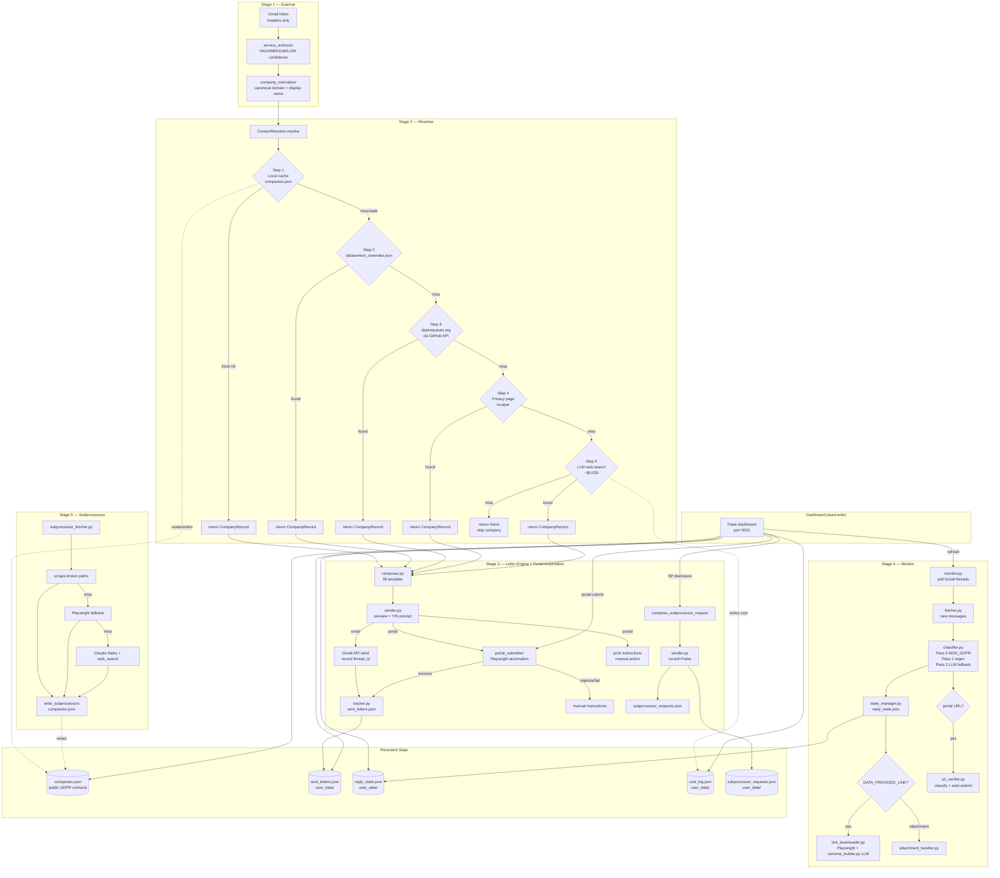

# GDPR Agent — Architecture Document

> **Audience:** Engineers and LLMs who need to understand, review, or modify this codebase.
> This is not a README. It assumes the reader can write Python and is unfamiliar with this specific system.

---

## 1. Problem This Solves

Under GDPR (and UK GDPR), individuals have the right to obtain a copy of all personal data a company holds about them — a Subject Access Request, or SAR. Exercising this right at scale is tedious: a typical Gmail inbox contains hundreds of companies that have received personal data (via account sign-ups, purchases, newsletter subscriptions), each requiring its own formal letter sent to a different privacy email address or web portal, followed by a 30-day wait, a possible identity-verification step, and eventually a data package to download and inspect. The non-trivial parts are: finding the correct GDPR contact for each company (which may require scraping a privacy page, querying an open-source database, or asking an LLM to search the web), normalising company identity across hundreds of overlapping email senders (accounts.google.com, youtube.com, and gmail.com are all Google), sending individual letters via Gmail's API, and then monitoring incoming replies to classify them (acknowledged? denied? requires action?) without reading every email manually.

---

## 2. System Overview

The pipeline runs in five stages triggered by `run.py`, with a separate monitoring CLI (`monitor.py`) and a Flask dashboard that also drives portal automation and subprocessor disclosure requests. The dashboard uses an app factory pattern: `dashboard/__init__.py` provides `create_app()` (107 lines — Flask setup, LoginManager, all blueprint registration, before_request hook), `dashboard/shared.py` (579 lines) holds shared helpers and constants, and `dashboard/app.py` is the entry point (33 lines — creates the app via `create_app()` and runs it). All routes live in 10 blueprints under `dashboard/blueprints/` (2,837 lines total): `pipeline_bp.py` (832), `company_bp.py` (568), `transfers_bp.py` (385), `data_bp.py` (285), `portal_bp.py` (239), `dashboard_bp.py` (204), `monitor_bp.py` (90), `costs_bp.py` (89), `api_bp.py` (78), `settings_bp.py` (67). Service modules under `dashboard/services/` (1,437 lines total): `monitor_runner.py` (807), `graph_data.py` (395), `jurisdiction.py` (235). Total dashboard: ~5,558 lines across all Python files.

Data flows strictly left to right within each run. The resolver writes back to `companies.json` on every successful resolution so the next run hits the cache. The monitor is a separate invocation that reads `sent_letters.json` and writes `reply_state.json`. The dashboard is purely read-only except for the `/refresh` route, which triggers an inline monitor run.

---

## 3. Module Map

| Directory | Purpose |
|-----------|---------|
| `scanner/` | Gmail header fetch (`inbox_reader.py`), confidence classification (`service_extractor.py`), domain normalisation (`company_normalizer.py`) |
| `contact_resolver/` | 5-step GDPR contact lookup chain (`resolver.py`), LLM web search (`llm_searcher.py`), privacy page scraper, cost tracking, subprocessor discovery, data models (`models.py`) |
| `letter_engine/` | SAR letter composition (`composer.py`), dispatch + Y/N prompt (`sender.py`), sent-letter logging (`tracker.py`) |
| `reply_monitor/` | Gmail reply fetcher, 3-pass classifier, state manager (`reply_state.json`), link downloader, schema builder, URL verifier, data models (`models.py`) |
| `portal_submitter/` | Playwright-based portal automation: form analysis, filling, CAPTCHA relay, OTP handling, platform detection, multi-step navigation |
| `dashboard/` | App factory (`__init__.py`: `create_app()`, 107 lines), shared helpers & constants (`shared.py`, 579 lines), entry point (`app.py`, 33 lines), 10 route blueprints under `blueprints/` (2,837 lines): `pipeline_bp.py` (832), `company_bp.py` (568), `transfers_bp.py` (385), `data_bp.py` (285), `portal_bp.py` (239), `dashboard_bp.py` (204), `monitor_bp.py` (90), `costs_bp.py` (89), `api_bp.py` (78), `settings_bp.py` (67). Service modules under `services/` (1,437 lines): `monitor_runner.py` (807), `graph_data.py` (395), `jurisdiction.py` (235). Support modules: `auth_routes.py` (203), `user_model.py` (128), `tasks.py` (81), `scan_state.py` (62), `admin_routes.py` (59), `sse.py` (32). Jinja2 templates, static JS/CSS. Total: ~5,558 lines |
| `auth/` | Gmail OAuth2 with per-account token storage, service cache, call logger |
| `config/` | `.env` loader via Pydantic (`settings.py`) |
| `templates/` | SAR email/postal templates, subprocessor disclosure request templates |
| `data/` | `companies.json` (public GDPR contact cache, committed), `dataowners_overrides.json` (hand-curated high-confidence records) |
| `user_data/` | Gitignored — OAuth tokens, `sent_letters.json`, `reply_state.json`, `cost_log.json`, `subprocessor_requests.json`, portal screenshots, CAPTCHA files |
| `tests/unit/` | All tests — pytest, inline test data, no external fixtures |

---

## 4. Detailed Documentation

Detailed documentation for each subsystem is split into separate files. Use `@docs/filename.md` references to pull them into context.

| Document | Contents |
|----------|----------|
| @docs/pipeline-stages.md | Stage 1 (Scanner), Stage 2 (Resolver), Stage 3 (Letter Engine), Stage 5 (Subprocessors), subprocessor disclosure request path, LLM call sites 1 and 6 |
| @docs/reply-monitor.md | Stage 4 full documentation: fetcher, 3-pass classifier, state manager, attachment handler, link downloader, schema builder, URL verifier, LLM call sites 2 and 3 |
| @docs/portal-automation.md | All 7 `portal_submitter/` modules, platform-specific constraints, LLM call sites 4 and 5 |
| @docs/dashboard-routes.md | Route reference, UI components, tag display tiers, 7-status system, known limitations |
| @docs/data-models.md | `companies.json`, `dataowners_overrides.json`, `sent_letters.json`, `reply_state.json` (CompanyState + ReplyRecord), `cost_log.json`, `subprocessor_requests.json`, portal models — all with "what breaks if malformed" sections |

---

## 5. External Dependencies

### Gmail API (Google Cloud)

**Used for:** Fetching email headers in Stage 1 (`gmail.readonly` scope); sending SAR letters in Stage 3 (`gmail.send` scope); fetching reply messages and thread contents in Stage 4 (readonly). The two scopes require separate OAuth tokens stored as `{email}_readonly.json` and `{email}_send.json`.

**Setup:** Requires a Google Cloud project with the Gmail API enabled and a `credentials.json` OAuth client credentials file at the repo root. First-run triggers a browser-based OAuth consent flow. Tokens are stored in `user_data/tokens/` and refreshed automatically by the Google auth library.

**If unavailable:** Stage 1 fails immediately and the run exits. Stage 3 email dispatch falls back to printing the letter body with a "send manually" instruction — portal/postal methods are unaffected. Stage 4 monitoring skips the account silently (the fetcher returns an empty list).

**Failure mode:** Loud in Stage 1 (exception propagates to `main()`). Quiet in Stages 3 and 4 (caught internally, manual fallback or skip).

---

### Anthropic API (Claude)

**Used for:** Contact resolution (Step 5, `llm_searcher.py`); reply classification fallback (`classifier.py`); data export schema analysis (`schema_builder.py`); portal form analysis (`form_analyzer.py`); portal navigation (`portal_navigator.py`); subprocessor discovery (`subprocessor_fetcher.py`). All calls use `claude-haiku-4-5-20251001`.

**If unavailable:** `llm_searcher.search_company()` returns `None` — the company is skipped. `_llm_classify()` returns `None` — the message gets `["HUMAN_REVIEW"]`. `schema_builder.build_schema()` returns `{}` — no schema is attached to the catalog. In all cases, failure is caught and the pipeline continues.

**Failure mode:** Silent — all three call sites catch `Exception` broadly. Cost tracking still fires for the call even if it fails (the `record_llm_call()` is called after the API call, using actual token counts from `response.usage`).

**Rate limits:** Haiku has generous rate limits at the token scale used here. No rate-limit handling is implemented because it has not been needed in practice.

---

### GitHub API (api.github.com)

**Used for:** Fetching the directory listing of the datarequests.org companies repository, and then downloading individual company JSON files. Unauthenticated, limited to 60 requests/hour.

**If unavailable or rate-limited:** `_fetch_dir_listing()` raises an exception caught by `_search_datarequests()`, which returns `None` — Step 3 is skipped and the chain proceeds to Step 4. The resolver logs a warning when `X-RateLimit-Remaining < 10`.

**Failure mode:** Silent at the company level (Step 3 is skipped). Loud at the session level if the rate limit warning is printed.

**Mitigation:** The directory listing is cached in-memory for the session (`self._dir_listing`), so only one GitHub API call is needed for the listing regardless of how many companies are looked up. Individual company file fetches still count against the limit.

---

### Playwright (optional for downloads, required for portal automation)

**Used for:** (1) Downloading GDPR data packages from links that are Cloudflare-protected or require JavaScript rendering (`link_downloader._download_playwright()`). (2) Portal automation — form analysis, filling, submission, CAPTCHA detection, and navigation (`portal_submitter/`). (3) Subprocessor page scraping as fallback for JS-rendered SPAs (`subprocessor_fetcher.py`).

**If not installed:** For downloads: `import playwright` raises `ImportError`, caught by `_download_playwright()` which returns `None`. The downloader falls back to `requests`. For portal automation: portal submission fails and returns `needs_manual=True`. If Playwright is installed but browser binaries are missing, the error message now includes a hint to run `python -m playwright install chromium`.

**Failure mode:** Silent fallback to `requests` for downloads. For portal automation, failure returns `PortalResult(success=False, needs_manual=True)` and the user receives manual instructions. Portal automation uses stealth scripts (`form_filler.py` injects JavaScript) to bypass automation detection.

---

## 6. LLM Usage Map

The system calls an LLM in six places. All use `claude-haiku-4-5-20251001` — never Sonnet or Opus — because the tasks are structured extraction and classification, not open reasoning.

Detailed documentation for each call site is in the relevant docs/ file — see @docs/pipeline-stages.md (call sites 1, 6), @docs/reply-monitor.md (call sites 2, 3), @docs/portal-automation.md (call sites 4, 5).

### LLM Cost Projections (500+ companies, cold cache)

| Call site | Per-company | 500 companies (cold) | Warm cache |
|-----------|-------------|----------------------|------------|
| Resolver (step 5) | ~$0.025 | ~$12.50 | ~$1 |
| Subprocessor discovery | ~$0.030–0.050 | ~$15–25 | Free (30-day TTL) |
| Classifier fallback | ~$0.010/reply | ~$5/cycle | — |
| Schema builder | ~$0.080/export | On demand | — |
| Portal form analyzer | ~$0.020 | One-time, cached 90 days | — |

---

## 7. Test Suite

### 7.1 Test Structure

All tests live in `tests/unit/`. There are no integration test directories, no end-to-end test scripts, and no test fixtures stored as separate files (all test data is inline). The test runner is `pytest` (configured without a `pytest.ini` or `pyproject.toml` — run with `python -m pytest tests/unit/ -q`).

Files follow the naming convention `test_{module_name}.py`. Each file corresponds to one source module. Test classes are named `Test{ConceptBeingTested}` (e.g. `TestContactResolver`, `TestNONGDPRPrepass`); individual test functions are named `test_{specific_scenario}`.

As of the last test run: **655 passed, 1 failed** (`test_portal_submitter` settings mock — known issue).

---

### 7.2 Test Coverage Map

| Module | File | Coverage |
|--------|------|----------|
| `scanner/inbox_reader.py` | `test_inbox_reader.py` | Good — pagination, max_results, missing headers, empty inbox |
| `scanner/service_extractor.py` | `test_service_extractor.py` | Good — confidence levels, deduplication, alias grouping, date ranges |
| `scanner/company_normalizer.py` | `test_company_normalizer.py` | Good — TLD handling, subdomain stripping, alias table, canonical_domain |
| `contact_resolver/resolver.py` | `test_resolver.py` | Excellent — all 5 steps, staleness logic, cache write-back, dataowners_override, datarequests matching |
| `contact_resolver/llm_searcher.py` | `test_llm_searcher.py` | Good — JSON extraction from prose/markdown, validate_and_build, cost tracking, API error |
| `contact_resolver/privacy_page_scraper.py` | `test_privacy_page_scraper.py` | Good — 4-URL fallback, email/portal extraction, email classification, verbose mode |
| `contact_resolver/cost_tracker.py` | Covered within `test_llm_searcher.py` | Partial — session log, persistent log, cost calculation covered; `record_resolver_result`, `set_llm_limit` not yet tested separately |
| `contact_resolver/models.py` | Covered indirectly | No dedicated tests; Pydantic validation tested implicitly |
| `letter_engine/composer.py` | `test_letter_engine.py` | Good — email/portal/postal template selection, variable substitution |
| `letter_engine/sender.py` | `test_letter_engine.py` | Good — Y/N/EOF handling, dry-run, Gmail dispatch mocked |
| `letter_engine/tracker.py` | `test_letter_engine.py` | Good — record_sent, get_log with empty/corrupt file |
| `reply_monitor/classifier.py` | `test_reply_classifier.py` | Excellent — all 18 tags, NON_GDPR pre-pass (including `alerts@` scoring), URL extraction from body, LLM fallback, multi-tag messages |
| `reply_monitor/fetcher.py` | `test_reply_fetcher.py` | Good — thread fetch, search fallback, body extraction (plain/HTML/multipart), attachment detection, deduplication |
| `reply_monitor/attachment_handler.py` | `test_attachment_handler.py` | Good — ZIP cataloging, JSON/CSV key extraction, category guessing, Gmail attachment download |
| `reply_monitor/state_manager.py` | `test_reply_state_manager.py` | Good — all 7 statuses, priority ordering, deadline computation, per-account isolation, update_state dedup |
| `reply_monitor/classifier.py` (LLM cache) | `test_reply_classifier.py` | Partial — LLM fallback tested; dedup cache (`_llm_cache`) not explicitly tested |
| `reply_monitor/schema_builder.py` | `test_schema_builder.py` | Good — empty export, corrupt ZIP, malformed JSON, successful extraction, dynamic truncation |
| `reply_monitor/link_downloader.py` | `test_link_downloader.py` | Good — DownloadResult, filename parsing, requests path, too-large, 404 expiry; Playwright path skipped if not installed |
| `reply_monitor/models.py` | Covered indirectly | No dedicated tests |
| `dashboard/blueprints/dashboard_bp.py` | `test_dashboard.py` | Partial — routes `/`, `/refresh` covered; `/cards`, `/reextract` untested |
| `dashboard/blueprints/company_bp.py` | `test_dashboard.py` | Partial — `/company/<domain>` covered |
| `dashboard/blueprints/pipeline_bp.py` | **Untested** | All pipeline routes (`/pipeline`, `/pipeline/review`, `/pipeline/scan-page`, SSE scan stream) — no test coverage |
| `dashboard/blueprints/data_bp.py` | **Untested** | Routes `/data/<domain>`, `/scan/<domain>`, `/download/<domain>` — no test coverage |
| `dashboard/shared.py` (helpers) | `test_snippet_clean.py` | Good — `_clean_snippet()` HTML entity/MIME/URL decoding, `_is_human_friendly()` predicate, `_dedup_reply_rows()` |
| `dashboard/blueprints/portal_bp.py` (portal routes) | `test_portal_submit_route.py` | Good — portal URL resolution from query param, overrides fallback, rejection when no URL, `save_portal_submission()` persistence lifecycle |
| `dashboard/` (UI health) | `test_ui_health.py` | Good — verifies required templates, static JS assets, service modules, and template cross-references exist; catches missing files after merges |
| `portal_submitter/` | `test_portal_submitter.py` | Good — models, platform detection, OTP sender hints, `build_user_data()`, `analyze_form()` with LLM mocking and cache expiration, CAPTCHA detection/relay, `fill_and_submit()` with various field types, OTP extraction, `wait_for_otp()` with mock Gmail, full `submit_portal()` workflow |
| `auth/gmail_oauth.py` | `test_oauth_refactor.py` | Good — service cache (hit/miss/expiry/clear), OAuth call logging (counter persistence, TSV format, caller info), `getProfile` skip optimization |
| `run.py` | `test_run.py` | Partial — no-services path, sent/skipped counts, `--max-llm-calls` flag, LLM limit enforcement; credentials.json check and Gmail connection path not tested |
| `monitor.py` | **Untested** | No test file for the monitor CLI entry point. |
| `config/settings.py` | **Untested** | No test; tested implicitly when settings are accessed in other tests |

---

### 7.3 Test Data & Mocking

All test data is inline — no external fixtures. LLM mock responses use `_make_text_response()` helpers with integer `.usage` attributes (not MagicMock auto-attributes — required for cost arithmetic). **No test makes a real API call** — Gmail API, GitHub API, Anthropic API, and Playwright are all mocked via `MagicMock` or injectable callables. GitHub API mocks omit `X-RateLimit-Remaining`, so the rate-limit warning path is untested.

---

### 7.4 Missing Tests

The following are genuinely untested — not undercovered, but absent:

**`auth/gmail_oauth.py` — core flows now tested** via `test_oauth_refactor.py` (service cache hit/miss/expiry/clear, OAuth call logging, getProfile skip). Remaining gaps: full browser-based OAuth consent flow, legacy token migration edge cases.

**`monitor.py` — entirely untested.** The CLI entry point logic (argument parsing, account selection, summary table printing, auto-download orchestration) is not tested. Risk: regressions in the monitor CLI are invisible until a live run.

**GitHub API rate limit warning** — the `X-RateLimit-Remaining` header check in `_fetch_dir_listing()` is untested. Risk: the warning path may never fire in practice (difficult to discover).

**Dashboard blueprint routes** — `/cards`, `/reextract` (`dashboard_bp`), `/api/body/<domain>/<id>` (`api_bp`), all pipeline routes (`pipeline_bp`), `/data/<domain>` routes (`data_bp`), `/transfers/*` (`transfers_bp`) have no or partial test coverage. Risk: template rendering errors or logic bugs are only discovered during live use.

**`cost_tracker.record_resolver_result()` and `set_llm_limit()`** — the new functions added during the code review have no dedicated tests (though `set_llm_limit` is exercised indirectly by `test_run.py::test_resolver_skips_llm_when_limit_reached`).

**LLM classifier `_llm_cache` deduplication** — the in-session cache that prevents re-classifying identical auto-replies has no test verifying it actually suppresses the second API call.

**`dataowners_overrides.json` schema validation** — the 20 newly added company entries are not validated by any test. A malformed entry (e.g. wrong `source` literal) would cause `CompanyRecord.model_validate()` to raise a `ValidationError` caught silently, skipping that company in Step 2.

---

## 8. Configuration & Secrets

All configuration is loaded from a `.env` file at the project root by `config/settings.py` using `python-dotenv`. The `Settings` Pydantic model is instantiated at import time as a module-level singleton (`settings = get_settings()`), meaning a missing `.env` file or missing variable causes a silent empty-string default for most fields.

**Required variables:**

| Variable | Used by | Silent if missing? |
|---|---|---|
| `GOOGLE_CLIENT_ID` | `auth/gmail_oauth.py` | Crashes OAuth flow with an opaque error |
| `GOOGLE_CLIENT_SECRET` | `auth/gmail_oauth.py` | Same |
| `ANTHROPIC_API_KEY` | All LLM call sites | LLM steps silently return `None`; rest of pipeline works |
| `USER_FULL_NAME` | SAR letter templates | Letter body contains empty string — looks broken |
| `USER_EMAIL` | SAR letter body | Letter body contains empty string |
| `USER_ADDRESS_LINE1` / `CITY` / `POSTCODE` / `COUNTRY` | SAR letter templates (postal) | Postal letters have missing address |
| `GDPR_FRAMEWORK` | SAR letter templates | Defaults to `"UK GDPR"` in `get_settings()` |

**`credentials.json`:** Must be present at the project root. `run.py` checks for it at startup and exits with a clear message if absent. Obtained from the Google Cloud Console as an OAuth 2.0 client ID JSON.

**`user_data/tokens/`:** Created automatically on first OAuth run. Tokens are long-lived refresh tokens; they expire only if the user revokes access or the Google project is deleted.

**What breaks silently:** Missing `ANTHROPIC_API_KEY` causes all LLM steps to silently return `None`. A run with an empty API key will successfully scan the inbox, resolve via cache/datarequests/scraper, compose letters, and send them — but companies that require LLM lookup will be silently skipped. The cost summary will show zero LLM calls, which is the only hint that something is wrong.

### Auth Subsystem (`auth/gmail_oauth.py`)

Centralised OAuth2 logic. Tokens are stored per-account in `user_data/tokens/{email}_readonly.json` and `{email}_send.json`. Auto-migrates legacy flat `token.json`/`token_send.json` on first run.

**Service cache:** In-memory TTL cache (5 minutes) keyed by `(email, scope, tokens_dir)` avoids redundant disk loads and OAuth refreshes — `_cache_get()`/`_cache_put()`/`clear_service_cache()`. When the email hint is provided and credentials were loaded from disk, the `getProfile` API call is skipped (saves one round-trip per service construction).

**OAuth call logger:** Every `get_gmail_service()`, `get_gmail_send_service()`, and `check_send_token_valid()` call appends a TSV line to `user_data/oauth_calls.log` with a monotonic counter, UTC timestamp, function name, reason (cache_hit/disk_load/browser_auth/etc.), email, and caller location. Thread-safe via `_log_lock`. The log is append-only — never truncate or rotate.

**Batched OAuth:** The `_reextract_missing_links()` helper in `dashboard/blueprints/monitor_bp.py` shares a single `get_gmail_service()` call across all pending re-extractions instead of one per reply.

**Gmail send tokens** (`*_send.json`) can be revoked by Google independently of readonly tokens. Symptoms: letters show "ready" forever, send task completes with 0 sent, no error shown. Diagnosis: run `check_send_token_valid(email)` or visit `/pipeline/reauth-send`. The dashboard pre-flight check in `pipeline_send()` (in `dashboard/blueprints/pipeline_bp.py`) calls `_send_token_valid()` before launching the background task.

---

## 9. Known Issues & Tech Debt

Issues identified during code review (2026-03-16). 29 issues were found and fixed (P1–P3 across llm_searcher, sender, cost_tracker, resolver, classifier, state_manager, link_downloader, schema_builder, privacy_page_scraper, portal_submitter, monitor, run.py). Open items only:

| Priority | Location | Issue |
|---|---|---|
| P3 | GitHub API authentication | No `GITHUB_TOKEN` support — rate limit is 60 req/hour unauthenticated. At 500+ companies this will be exhausted. |
| P3 | Resolver concurrency | The 5-step chain is sequential per domain and across domains. Steps 1–4 could be parallelised with `ThreadPoolExecutor`. |
| P3 | Dashboard `/refresh` | Blocks the HTTP response during a full monitor run. Should use a background thread or task queue. |
| P3 | Monitor reply dedup cache | `_llm_cache` in `classifier.py` resets between runs. Identical auto-replies in separate runs each trigger an LLM call. |
| P2 | `portal_submitter/submitter.py` | Ketch portals always fail reCAPTCHA v3 in headless Playwright — falls back to manual. No known workaround. |
| P3 | `dashboard/blueprints/` | Flask routes and template rendering have partial test coverage — only pure helper functions (in `shared.py`) and a few routes (`/`, `/refresh`, `/company/<domain>`) are tested. Blueprint extraction complete: all routes in 10 blueprints (2,837 lines), services extracted (1,437 lines), `app.py` reduced to 33-line entry point. |
| — | `monitor.py` | Zero test coverage for the CLI entry point. |

---

## 10. How to Extend This

### Adding a new resolver step

The resolver chain in `resolver.py` is explicit — it is not a plugin system. Steps are hardcoded in `ContactResolver.resolve()`. To add a step (e.g. a DuckDuckGo scraper as a free step before the LLM):

1. Write the lookup function in a new file under `contact_resolver/`, returning `CompanyRecord | None`. Accept `domain` and `company_name` as arguments.
2. Inject it as a callable in `ContactResolver.__init__()` (follow the `http_get`, `privacy_scrape`, `llm_search` pattern — this enables test injection).
3. Insert the call in `ContactResolver.resolve()` between the existing steps, calling `cost_tracker.record_resolver_result("your_source_name")` on success.
4. Add the new `source` literal to the `Literal[...]` type in `CompanyRecord.source` in `models.py`.
5. Add its TTL in `_STALENESS_DAYS` in `resolver.py`.
6. Write tests in `tests/unit/test_resolver.py` following the existing pattern — inject a mock callable and assert the correct fallthrough behaviour.

Do not change the source list in `CompanyRecord.source` without understanding that `data/companies.json` contains serialised records with old source values — Pydantic will reject records with unknown source literals on load.

### Adding a new classifier tag

Tags are defined in three places that must stay in sync:

1. `reply_monitor/models.py` — the `REPLY_TAGS` list (displayed in the dashboard)
2. `reply_monitor/classifier.py` — add a regex rule to `_RULES` (a list of `(tag, [(field, pattern), ...])` tuples), or describe the tag in `_llm_classify()`'s prompt
3. `reply_monitor/state_manager.py` — decide whether the new tag is terminal (`_TERMINAL_TAGS`), action-requiring (`_ACTION_TAGS`), or acknowledging (`_ACK_TAGS`), and add it accordingly

If the tag represents a terminal state, verify that `compute_status()` priority logic handles it correctly. Write tests in `test_reply_classifier.py` covering at least the regex path and the NON_GDPR interaction.

### Adding a new letter template

Templates are `letter_engine/templates/sar_email.txt` and `sar_postal.txt`. The available substitution variables are defined in `composer.py`. To add a new variable:

1. Add the placeholder `{variable_name}` to the template.
2. Add the substitution in `composer.py`'s `_fill_template()` function.
3. Ensure the value is available from either `settings` or the `CompanyRecord` — do not introduce new dependencies.
4. Update `test_letter_engine.py` to verify the substitution.

If you want a third template type (e.g. a GDPR erasure request rather than a SAR), you would need to add a new `preferred_method` value to `Contact.preferred_method`'s `Literal` type and update `sender.py`'s dispatch logic.

### Changing the LLM model

All three call sites hard-code `"claude-haiku-4-5-20251001"`. To change the model:

1. Update the model string at each call site.
2. Update `_PRICING` in `cost_tracker.py` with the new model's pricing.
3. Update `CLAUDE.md` to reflect the change.
4. Note that `web_search_20250305` tool compatibility must be verified for new model versions — it is an Anthropic-specific tool and may behave differently across model generations.

The `llm_searcher.py` call site uses the `web_search_20250305` tool, which is only available on certain models. If you switch to a model that does not support this tool, the API call will fail with an error and the function will return `None`.

### Scaling to 500+ companies

The primary bottlenecks at scale are:

1. **GitHub API rate limit (60 req/hour unauthenticated):** Add `GITHUB_TOKEN` to `.env` and pass it as a `Bearer` token header in `_fetch_dir_listing()`.
2. **Sequential resolver:** Wrap the resolve loop in `run.py` with `concurrent.futures.ThreadPoolExecutor` — the resolver is I/O-bound and safe to parallelize because each domain resolves independently. Limit concurrency to avoid hammering GitHub and privacy pages simultaneously.
3. **LLM call cost:** Pre-populate `data/dataowners_overrides.json` with well-known services (20 entries are already included). Every entry saved there saves ~$0.025 permanently. Use `--max-llm-calls N` to cap costs on any given run.
4. **Interactive Y/N prompt:** The current design requires a human to approve each letter. For bulk runs, consider adding a `--auto-send` flag that skips the prompt (with appropriate safety warnings).
